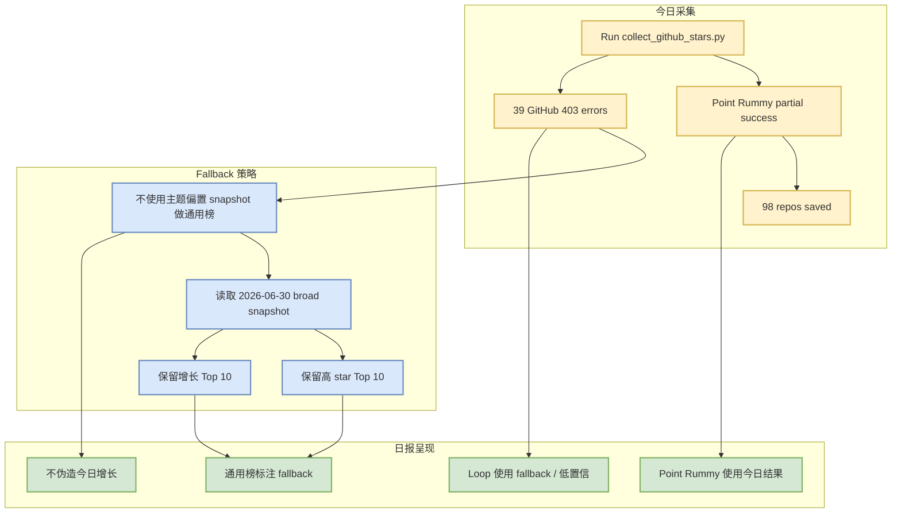

# GitHub Snapshot Top 10 Fallback - 2026-07-07

> 日期：2026-07-07  
> 来源类型：GitHub API snapshot / fallback watchlist  
> 今日 snapshot：Automation/state/github-stars-2026-07-07.json  
> fallback snapshot：Automation/state/github-stars-2026-06-30.json

## 一句话结论

今日 GitHub broad AI 查询在 Point Rummy 主题查询后被 403 rate limit 打断，因此通用高 star / 增长榜继续使用 2026-06-30 broad snapshot fallback，不能解读为今日真实增长。

## TL;DR

- 今日已生成 snapshot：`Automation/state/github-stars-2026-07-07.json`。
- 今日 repos=98，主要由 Point Rummy 主题结果构成。
- errors=39，broad AI / loop engineering 查询大多 403。
- 通用榜单使用 2026-06-30 broad fallback，明确标注低置信。

## 信息压缩图示

## 高 star fallback Top 10

| 排名 | repo | stars | stars_delta | 说明 |
|---:|---|---:|---:|---|
| 1 | affaan-m/ECC | 223700 | 2505 | Claude Code / agent harness 生态信号 |
| 2 | NousResearch/hermes-agent | 206100 | 4047 | agent runtime / skills / memory |
| 3 | tensorflow/tensorflow | 195981 | -35 | ML 框架基座 |
| 4 | Significant-Gravitas/AutoGPT | 185228 | 76 | agent framework 历史高热 |
| 5 | ollama/ollama | 175177 | 310 | local model serving / runtime |
| 6 | f/prompts.chat | 164555 | 289 | prompt asset library |
| 7 | huggingface/transformers | 162049 | 172 | model training / inference 基座 |
| 8 | langflow-ai/langflow | 150233 | 191 | agent workflow builder |
| 9 | langgenius/dify | 147098 | 629 | production LLMOps / workflow platform |
| 10 | open-webui/open-webui | 143525 | 623 | local model UI / serving entry |

## 专业解读

本 fallback 的价值是“保持日报结构完整与历史 watchlist 连续”，不是提供今日 GitHub 热度结论。由于当前 snapshot 被 Point Rummy 主题结果主导，如果直接拿今日 high_star_top10 会把通用 AI Infra 榜单污染成低 star Rummy repo 榜。

## 对我的影响

- 对 broad AI repo 的增长判断今天应降权。
- 可继续关注 Hermes Agent、Ollama、Transformers、Dify、Open WebUI 作为基础设施 watchlist。
- 后续应给 collector 加 GitHub token 或分批运行，减少 403。

## 可信度与局限性

- 今日 snapshot 文件可信，但 broad 覆盖不完整。
- fallback snapshot 是历史数据，不代表 2026-07-07 新增热度。

## 我应该如何跟进

1. 配置 authenticated GitHub API collector。
2. 将 niche/theme 查询与 broad 查询拆成不同时间窗口。
3. 在日报继续显式标注 fallback，直到 broad snapshot 恢复。

## 相关链接

- 今日 snapshot：Automation/state/github-stars-2026-07-07.json
- GitHub search：https://github.com/search?q=topic%3Aartificial-intelligence&type=repositories

#ai-radar #github #fallback #ai-infra
