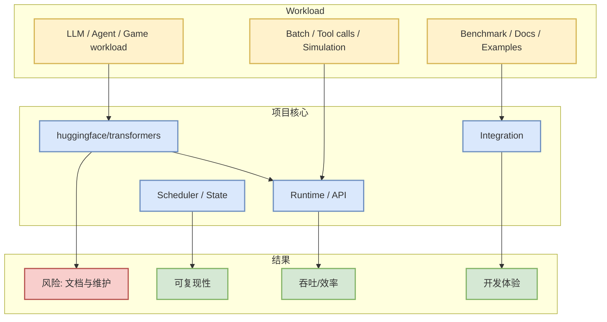

# huggingface/transformers

> 日期：2026-07-09
> 来源：GitHub
> 原文：https://github.com/huggingface/transformers

## 一句话结论
🤗 Transformers: the model-definition framework for state-of-the-art machine learning models in text, vision, audio, and multimodal models, for both inference an

## TL;DR
- stars / forks：162393 / 33830
- language：Python
- updated_at：2026-07-09T02:40:44Z
- 是否值得试用：是

## 元信息表
| 字段 | 值 |
|---|---|
| repo | huggingface/transformers |
| stars | 162393 |
| forks | 33830 |
| language | Python |
| topics | audio, deep-learning, deepseek, gemma, glm, hacktoberfest, llm, machine-learning |
| updated_at | 2026-07-09T02:40:44Z |
| 原文 | [GitHub](https://github.com/huggingface/transformers) |

## 信息压缩图示

## 机制 / 试用矩阵
| 维度 | 判断 |
|---|---|
| 可落地性 | 高 |
| 适合场景 | AI Infra、LLM agent、coding workflow 或 Point Rummy 业务参考 |
| 风险 | star/更新不能替代质量评估，需要跑 examples 和测试 |

## 专业解读
该项目的价值取决于它是否提供可复用的 runtime、API、规则环境、评测基准或工程模式。对 AI Infra，应优先看 scheduler/cache/runtime；对 coding agent，应优先看权限、上下文、工具调用和回滚机制。

## 通俗解释
它像一个可拆解的样板工程：先看是否有人用、是否还在更新，再决定是否拿来跑实验。

## 对我的影响
- 可进入 watchlist：https://github.com/huggingface/transformers
- 若是 serving / agent 项目，建议对比现有 vLLM、SGLang、Codex、Claude Code 工作流。
- 若是 rummy 项目，先抽取规则、状态、动作和 reward schema。

## 可信度与局限性
GitHub 元数据来自 API 或 snapshot；未做源码审计，质量判断需后续验证。

## 我应该如何跟进
1. 克隆并运行 quickstart / tests。
2. 记录 API、数据结构和 benchmark。
3. 判断是否可复用到当前 infra / agent / rummy 环境。

## 相关链接
- [GitHub](https://github.com/huggingface/transformers)

#ai-radar #github
