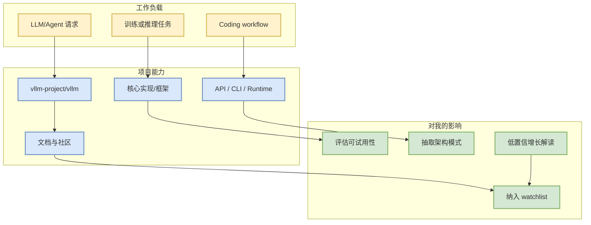

# vllm-project/vllm - 2026-07-10

## 一句话结论
vLLM 仍是高吞吐 LLM serving 核心实现，重点关注 scheduler、KV cache、batching 与多 GPU runtime。

## TL;DR
- repo：[vllm-project/vllm](https://github.com/vllm-project/vllm)
- stars / forks：85842 / 19205
- language：Python
- updated_at：2026-07-10T00:41:50Z
- 来源类型：GitHub direct repo fallback（GitHub Search 403 时用于保持 broad AI Infra/Loop Engineer 视角）

## 元信息表
| 字段 | 内容 |
|---|---|
| 大类 | GitHub / AI Infra 项目 |
| repo | vllm-project/vllm |
| topics | cuda, inference, llm, serving, kv-cache |
| 原文 | https://github.com/vllm-project/vllm |
| 可信度 | 中：direct API 可读，但不是完整全网增长榜 |

## 信息压缩图示

## 专业解读
vllm-project/vllm 今天通过 direct GitHub API 进入榜单。由于 GitHub Search 已 403，本页不把它解释成“全网增长最快”，而是把它作为固定 watched repo 观察点。对 AI Infra 工程来说，重点不是单日 star，而是它在 serving、training runtime、agent loop 或工具协议中的位置。

## 通俗解释
把它当成每天都要看一眼的仪表盘项目：如果 release、commit、issue 或 star 发生异常，就可能意味着生态方向变化。

## 关键机制拆解
| 机制 | 观察点 | 我应该看什么 |
|---|---|---|
| 代码活跃度 | updated_at / pushed_at | 是否有持续提交 |
| 社区热度 | stars / forks | 是否值得投入试用 |
| 工程位置 | topics / description | 对 serving、training、agent loop 的影响 |
| 风险 | fallback 来源 | 不把 direct watch 当作全网榜单 |

## 对我的影响
- AI Infra：关注 runtime、scheduler、cache、distributed training 或模型接入层。
- LLM/Agent：关注工具调用、上下文协议、CLI/TUI 和 eval loop。
- RL/Game AI：若和 post-training/agent 框架有关，可映射到 rollout、reward 和 harness。

## 可信度与局限性
- GitHub direct API 元数据可信。
- 今日 GitHub Search 403，增长榜不是全网完整统计。
- 需要后续看 release notes、benchmarks、issues 才能判断生产可用性。

## 我应该如何跟进
1. 订阅 releases / commits。
2. 若属于 serving/training runtime，跑最小 benchmark。
3. 若属于 coding-agent loop，加入 Claude Code / Codex / Gemini CLI / Cline 对比矩阵。

## 相关链接
- 原文：https://github.com/vllm-project/vllm
- 今日日报：[[Daily/2026-07-10]]

## 标签
#ai-radar #github #ai-infra #loop-engineering
