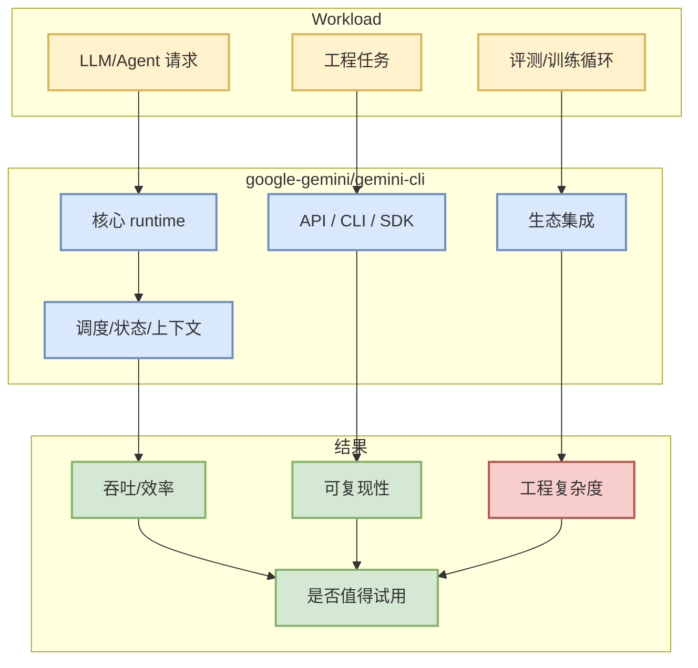

# google-gemini/gemini-cli

> 类型：GitHub 项目
> 大类：GitHub
> 小类：AI Infra / Agent / Coding Workflow
> 推荐等级：必读
> 创建日期：2026-07-25
> 原文链接：https://github.com/google-gemini/gemini-cli
> 网页详情：https://github.com/dyt27666-oss/AI-news-report-obsidians/blob/main/GitHub/2026-07-25/google-gemini-gemini-cli.md
> 返回日报：[[Daily/2026-07-25]]

## 一句话结论

google-gemini/gemini-cli 是今日直接 watched-repo fallback 中的高信号项目：把 Gemini 带入终端的开源 AI agent。

## TL;DR

- **它是什么**：把 Gemini 带入终端的开源 AI agent。
- **为什么重要**：stars 106157、forks 14311，属于 AI Infra / agent / coding workflow 的核心观察对象。
- **和我相关的点**：可作为 serving、训练、agent loop 或 coding 工具链选型基线。
- **建议动作**：加入 watchlist；不要把今日增长当全 GitHub 完整日增，因为 GitHub Search 403。

## 元信息

| 字段 | 内容 |
|---|---|
| repo | google-gemini/gemini-cli |
| stars / forks | 106157 / 14311 |
| language | TypeScript |
| updated_at | 2026-07-25T00:26:07Z |
| topics | ai-agents, cli, mcp-client, mcp-server |
| 原文 | [GitHub](https://github.com/google-gemini/gemini-cli) |
| 增长依据 | direct GET fallback + historical snapshot |

## 信息压缩图示

### 影响力 × 可落地性

| 维度 | 判断 |
|---|---|
| 影响力 | 高：生态 stars/forks 足够大 |
| 可落地性 | 中到高：需结合具体任务小规模试用 |
| 风险 | 今日 GitHub Search 受限，增长榜是 watched-repo fallback |

## 专业解读

该项目的主要价值在于作为固定观察集合的一部分：即使 GitHub Search API 被限流，直接 repo 元数据仍能给出稳定的高 star 基准。对 AI Infra 工程来说，高 star 并不等于立即采用，但能提示生态主线、issue/release 活跃度和社区集成压力。

## 对我的影响

| 维度 | 影响 | 建议动作 |
|---|---|---|
| AI Infra | 可作为 serving/training/agent 生态基线 | 观察 release 与 benchmark |
| LLM 工程 | 帮助判断工具链成熟度 | 小任务试用 |
| RL / Game AI | 可借鉴工程化/评测 loop | 不直接迁移，先做 POC |
| Agent / Eval | 对 coding-agent loop 和工具协议有参考意义 | 记录失败模式 |

## 相关链接

- 原文：https://github.com/google-gemini/gemini-cli
- 网页详情：https://github.com/dyt27666-oss/AI-news-report-obsidians/blob/main/GitHub/2026-07-25/google-gemini-gemini-cli.md

## 标签

#ai-radar #github #ai-infra #agent
