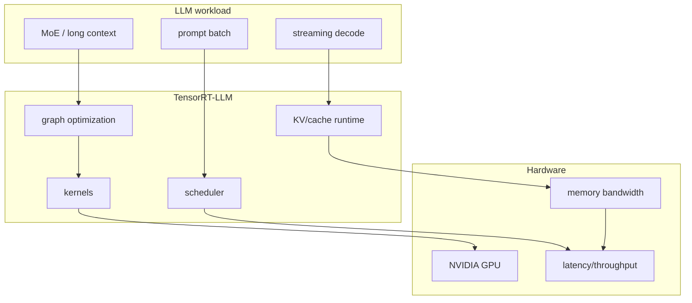
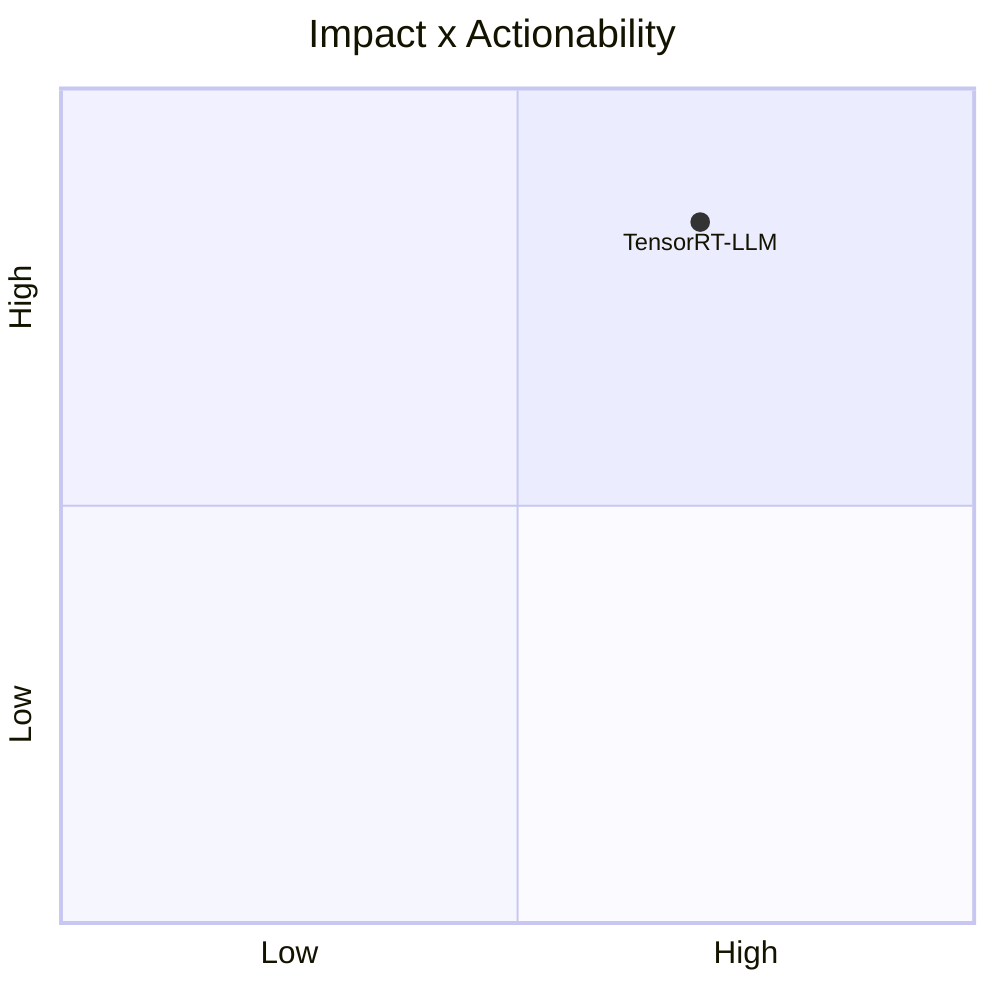

# NVIDIA/TensorRT-LLM

> Type: GitHub detail
> Date: 2026-07-13
> Source: https://github.com/NVIDIA/TensorRT-LLM
> Return: [[Daily/2026-07-13]]

## One-line Takeaway

TensorRT-LLM remains a key NVIDIA inference runtime to watch for GPU serving optimization.

## TL;DR

- What it is: NVIDIA LLM inference optimization stack.
- Why it matters: affects latency, throughput, kernels, and hardware-specific serving.
- Action: compare with vLLM and SGLang for deployment constraints.

## Metadata

| Field | Value |
|---|---|
| Source | GitHub |
| Source type | repo / direct watched fallback |
| Original | [repo](https://github.com/NVIDIA/TensorRT-LLM) |
| Daily | [[Daily/2026-07-13]] |

## Diagram

## Professional Notes

Use this as a serving-runtime watch item; deployment value depends on NVIDIA hardware, model support, and integration cost.

## Follow-up

1. Compare benchmark claims with vLLM/SGLang.
2. Check model support and kernel changes.
3. Evaluate operational complexity.

#ai-radar #serving #nvidia
