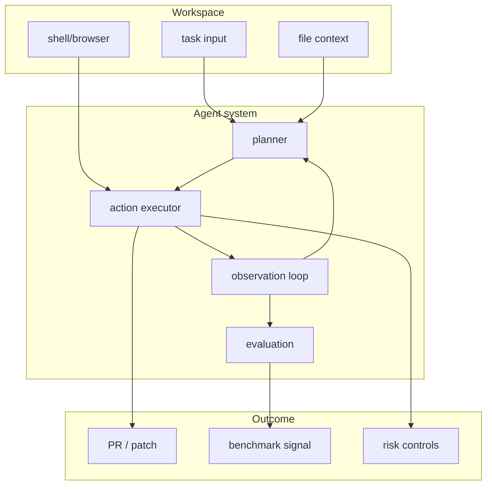
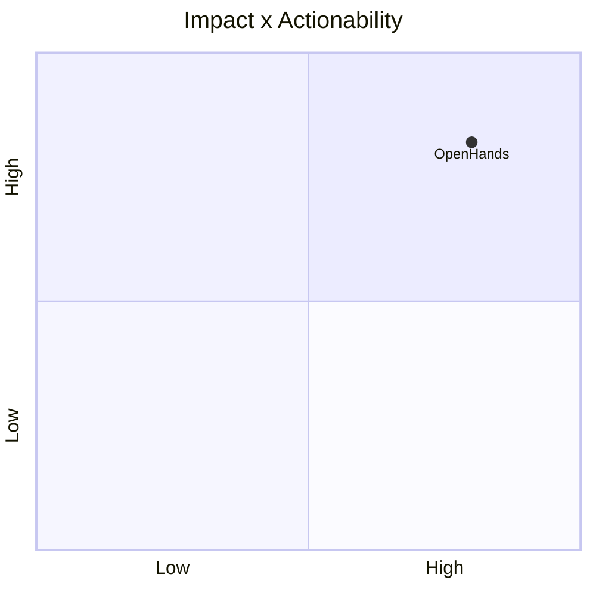

# OpenHands/OpenHands

> Type: GitHub detail
> Date: 2026-07-13
> Source: https://github.com/OpenHands/OpenHands
> Return: [[Daily/2026-07-13]]

## One-line Takeaway

OpenHands is a strong open-source reference for full coding-agent workspaces and harness design.

## TL;DR

- What it is: an AI-driven development environment.
- Why it matters: useful for loop engineering, sandboxing, and agent evaluation.
- Action: watch architecture and evaluation harness changes.

## Metadata

| Field | Value |
|---|---|
| Source | GitHub |
| Source type | repo / direct watched fallback |
| Original | [repo](https://github.com/OpenHands/OpenHands) |
| Daily | [[Daily/2026-07-13]] |

## Diagram

## Professional Notes

OpenHands is relevant for designing robust coding-agent loops, especially around observation, retry, and evaluation.

## Follow-up

1. Inspect harness abstractions.
2. Compare to Codex/Claude terminal workflows.
3. Track benchmarks.

#ai-radar #loop-engineering #coding-agent
