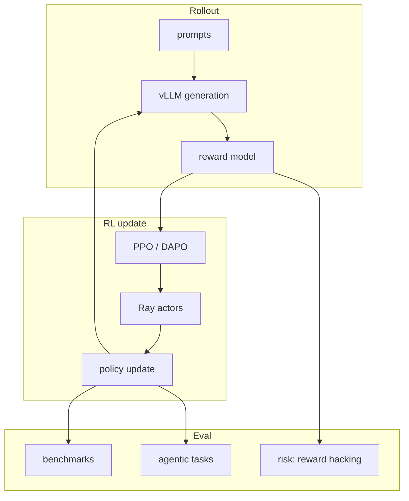
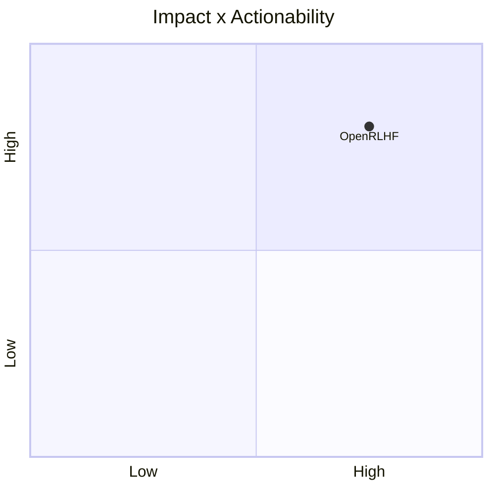

# OpenRLHF/OpenRLHF

> Type: GitHub detail
> Date: 2026-07-13
> Source: https://github.com/OpenRLHF/OpenRLHF
> Return: [[Daily/2026-07-13]]

## One-line Takeaway

OpenRLHF remains a practical Ray/vLLM-based stack for scalable agentic RL and RLHF.

## TL;DR

- What it is: scalable RLHF framework with Ray and vLLM integration.
- Why it matters: directly relevant to PPO/GRPO-style LLM and VLM post-training.
- Action: compare algorithm support and serving/training coupling with verl.

## Metadata

| Field | Value |
|---|---|
| Source | GitHub |
| Source type | repo / direct watched fallback |
| Original | [repo](https://github.com/OpenRLHF/OpenRLHF) |
| Daily | [[Daily/2026-07-13]] |

## Diagram

## Professional Notes

OpenRLHF is relevant when post-training requires scalable rollout plus high-throughput inference. Validate examples before production use.

## Follow-up

1. Compare with verl.
2. Check algorithm and model support.
3. Run a small rollout/eval experiment.

#ai-radar #rlhf #agentic-rl
