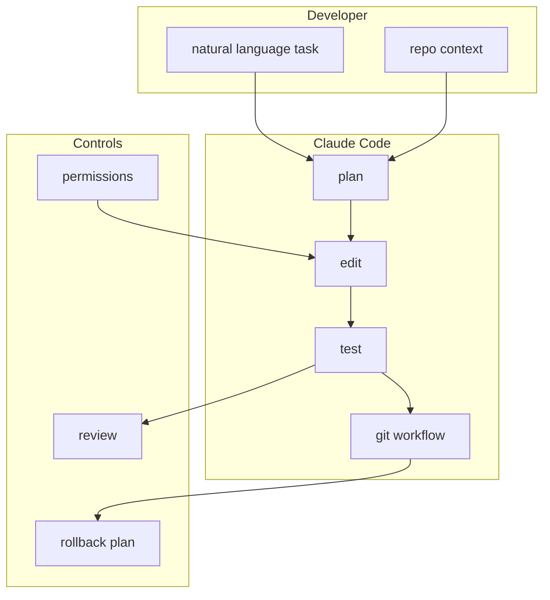
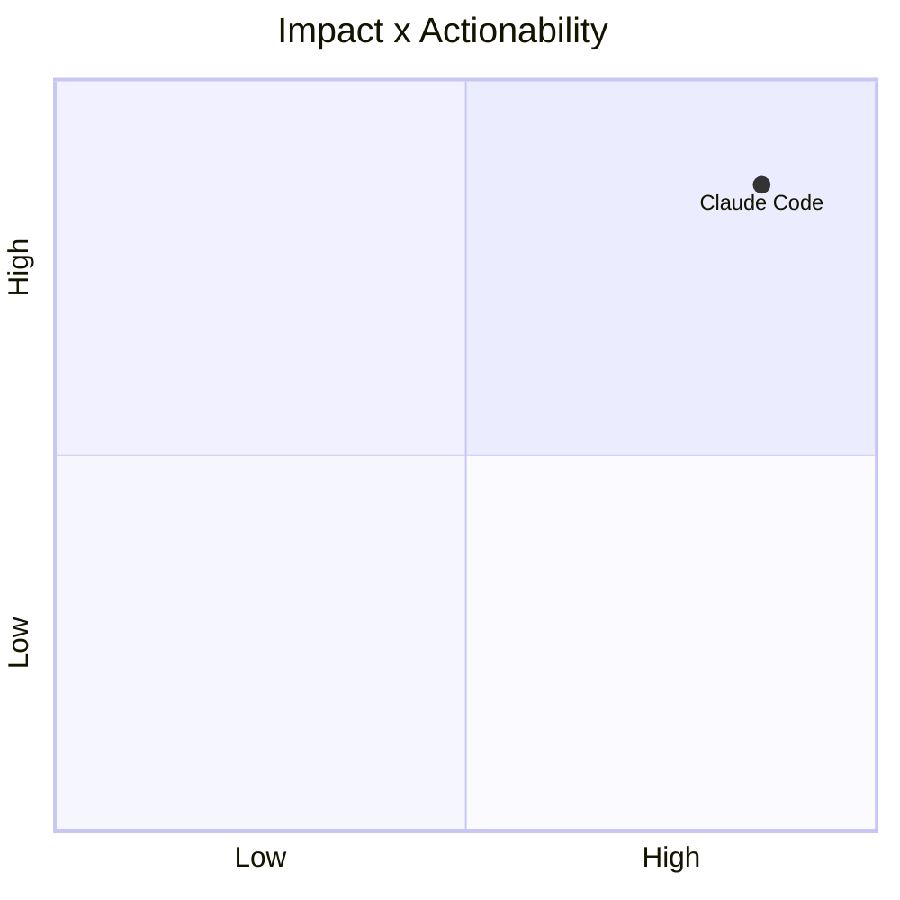

# anthropics/claude-code

> Type: GitHub detail
> Date: 2026-07-13
> Source: https://github.com/anthropics/claude-code
> Return: [[Daily/2026-07-13]]

## One-line Takeaway

Claude Code remains one of the strongest CLI agent workflow signals.

## TL;DR

- What it is: an agentic coding tool in the terminal.
- Why it matters: directly informs multi-agent coding, review, and permission workflows.
- Action: compare with OpenAI Codex and Gemini CLI.

## Metadata

| Field | Value |
|---|---|
| Source | GitHub |
| Source type | repo / direct watched fallback |
| Original | [repo](https://github.com/anthropics/claude-code) |
| Daily | [[Daily/2026-07-13]] |

## Diagram

## Professional Notes

The daily star delta is a watched-repo delta, not complete all-GitHub growth. It is still valuable for coding-agent workflow tracking.

## Follow-up

1. Check changelog for permission and context-window changes.
2. Compare agent loop with Codex.
3. Track tmux/multi-agent supervision patterns.

#ai-radar #claude-code #coding-agent
