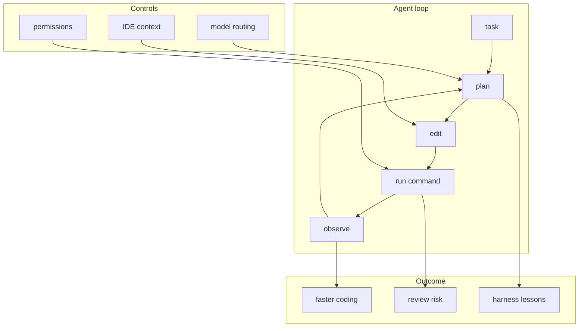
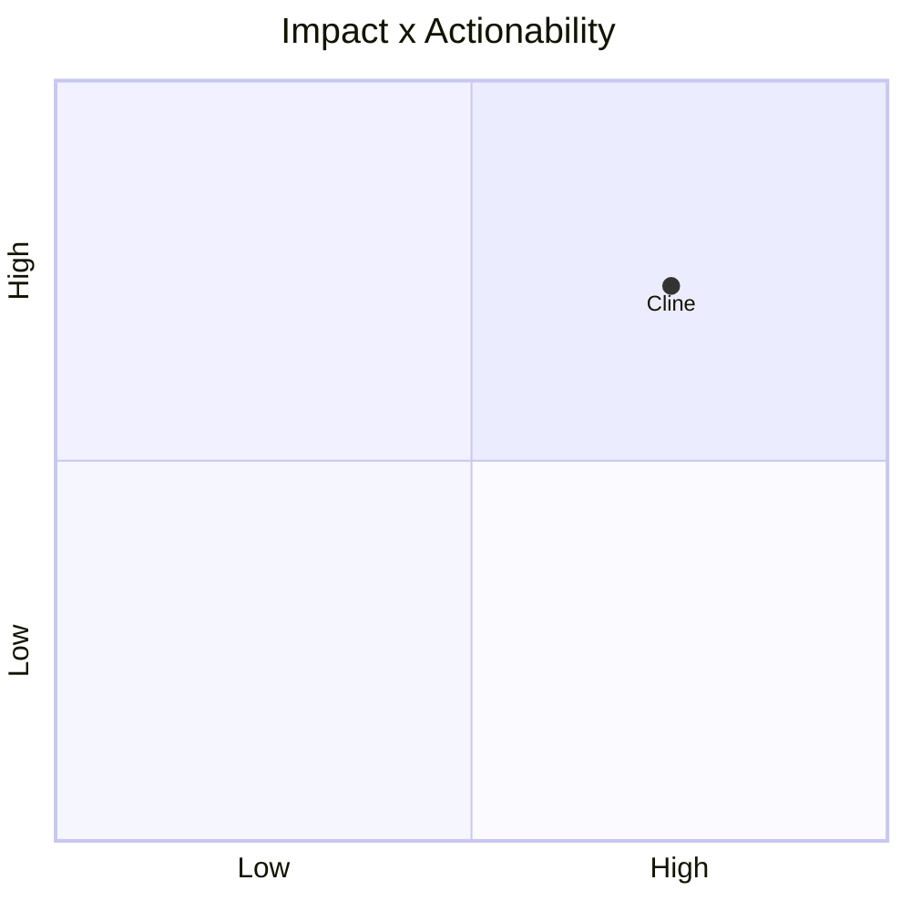

# cline/cline

> Type: GitHub detail
> Date: 2026-07-13
> Source: https://github.com/cline/cline
> Return: [[Daily/2026-07-13]]

## One-line Takeaway

Cline is a key IDE/CLI autonomous coding-agent signal for loop engineering.

## TL;DR

- What it is: an autonomous coding agent as extension / SDK / assistant.
- Why it matters: useful for studying agent permissions, tool execution, and edit loops.
- Action: watch release notes and compare with Continue / Roo Code.

## Metadata

| Field | Value |
|---|---|
| Source | GitHub |
| Source type | repo / direct watched fallback |
| Original | [repo](https://github.com/cline/cline) |
| Daily | [[Daily/2026-07-13]] |

## Diagram

## Professional Notes

The daily uses this as watched fallback data after GitHub Search rate limits. Treat it as a durable coding-agent watchlist item.

## Follow-up

1. Inspect extension permissions.
2. Compare agent loop telemetry with Hermes/Codex workflows.
3. Track release tags.

#ai-radar #github #loop-engineering
