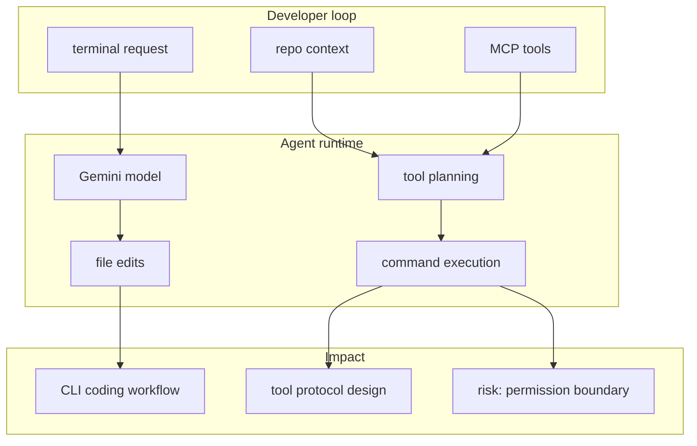
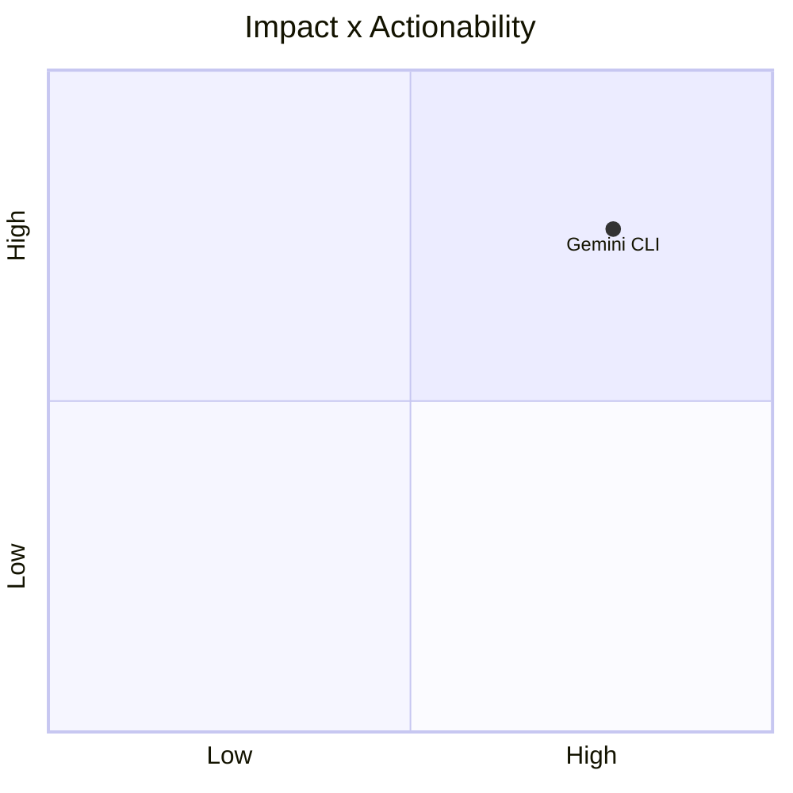

# google-gemini/gemini-cli

> Type: GitHub detail
> Date: 2026-07-13
> Source: https://github.com/google-gemini/gemini-cli
> Return: [[Daily/2026-07-13]]

## One-line Takeaway

Gemini CLI remains a high-signal terminal agent project for MCP-aware coding workflows.

## TL;DR

- What it is: an open-source Gemini terminal agent.
- Why it matters: it exposes CLI agent patterns and MCP integration signals.
- Action: watch release notes and compare with Codex / Claude Code.

## Metadata

| Field | Value |
|---|---|
| Source | GitHub |
| Source type | repo / direct watched fallback |
| Original | [repo](https://github.com/google-gemini/gemini-cli) |
| Daily | [[Daily/2026-07-13]] |

## Diagram

## Professional Notes

This page exists because the daily mandatory tables link to the repo. The row is based on direct watched-repo fallback, not a complete all-GitHub ranking.

## Follow-up

1. Check latest releases.
2. Compare MCP behavior with Codex and Claude Code.
3. Track permission and sandbox defaults.

#ai-radar #github #coding-agent
