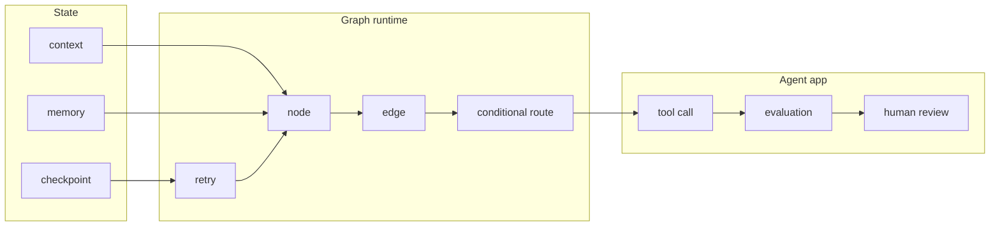
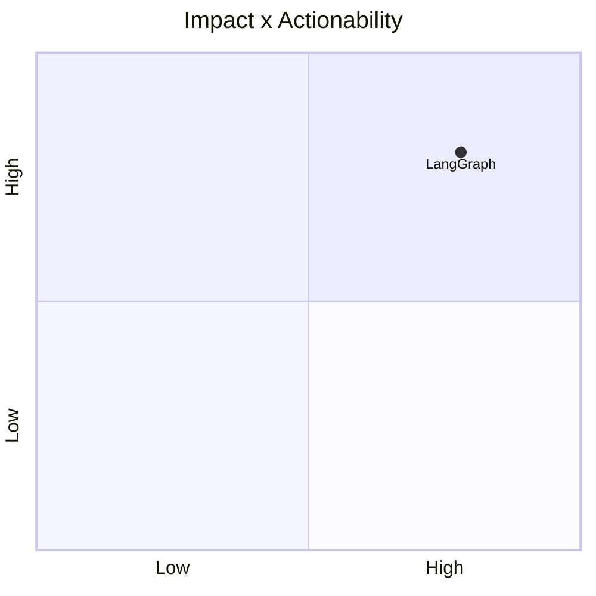

# langchain-ai/langgraph

> Type: GitHub detail
> Date: 2026-07-13
> Source: https://github.com/langchain-ai/langgraph
> Return: [[Daily/2026-07-13]]

## One-line Takeaway

LangGraph is still a core state-machine abstraction for resilient production agents.

## TL;DR

- What it is: graph-based agent orchestration.
- Why it matters: maps naturally to coding-agent and eval loops.
- Action: study state, checkpoint, and retry patterns.

## Metadata

| Field | Value |
|---|---|
| Source | GitHub |
| Source type | repo / direct watched fallback |
| Original | [repo](https://github.com/langchain-ai/langgraph) |
| Daily | [[Daily/2026-07-13]] |

## Diagram

## Professional Notes

For loop engineering, LangGraph offers a vocabulary for state, routing, recovery, and eval checkpoints.

## Follow-up

1. Track release notes.
2. Map coding-agent loop into graph states.
3. Compare with AutoGen.

#ai-radar #agent #loop-engineering
