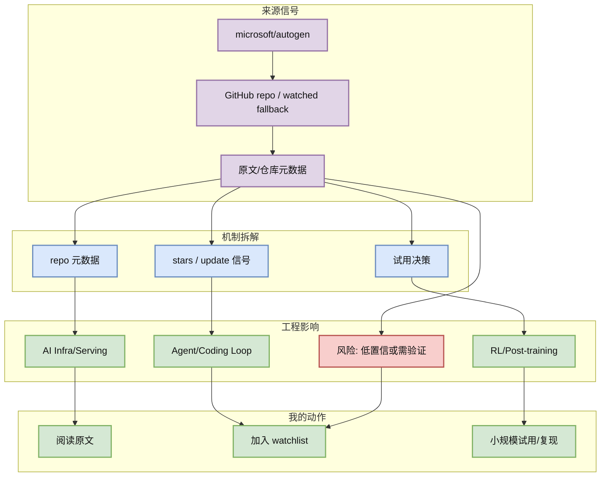
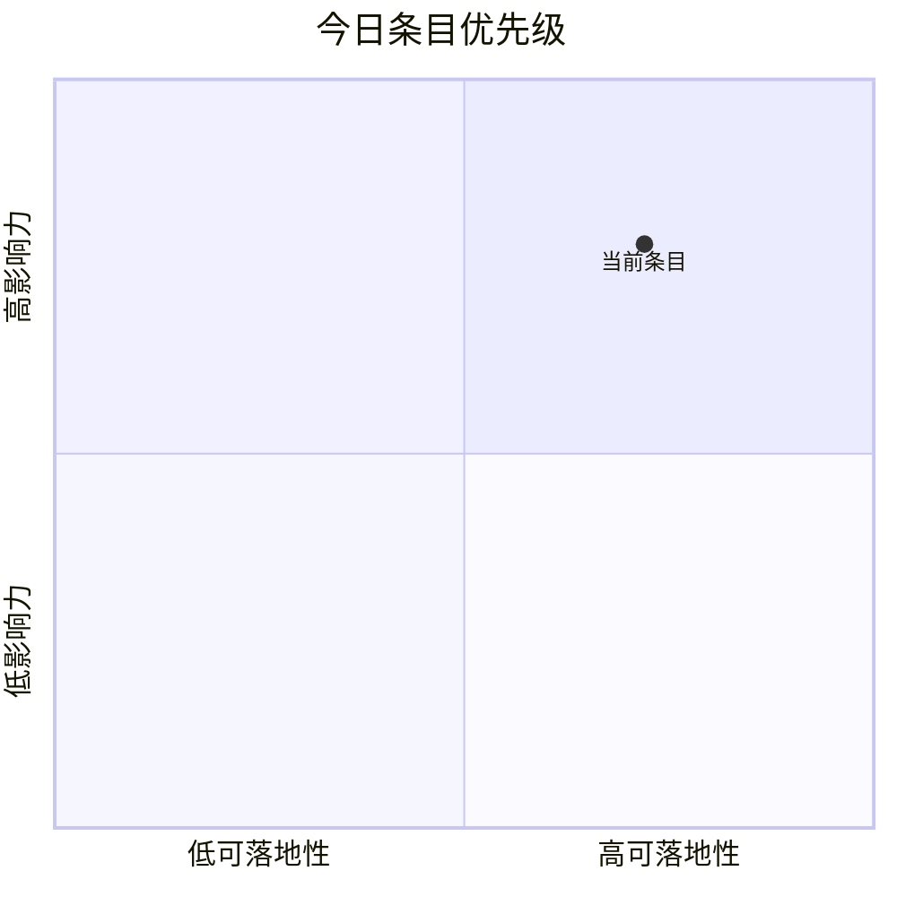

# microsoft/autogen

> 类型：GitHub
> 大类：AI Radar 详情
> 小类：GitHub repo / watched fallback
> 推荐等级：可 skim
> 创建日期：2026-07-13
> 原文链接：https://github.com/microsoft/autogen
> 网页详情：https://github.com/dyt27666-oss/AI-news-report-obsidians/blob/main/GitHub/AIInfra/2026-07-13/microsoft__autogen.md
> 返回日报：[[Daily/2026-07-13]]

## 一句话结论

多 agent 编程框架，适合作为 agent orchestration 和 eval loop 参考。

## TL;DR

- **它是什么**：microsoft/autogen 的今日雷达条目。
- **为什么重要**：该 repo 对今日 AI Infra / coding agent / RL radar 有可行动观察价值。
- **和我相关的点**：用于 AI Infra / LLM serving / agent loop / RL 训练判断。
- **建议动作**：先读摘要和原文，再按表格里的机制决定是否试用或复现。

## 元信息

| 字段 | 内容 |
|---|---|
| 发布方/来源 | microsoft/autogen |
| 栏目/来源类型 | GitHub repo / watched fallback |
| 发布时间 | 2026-07-13 |
| 原文 | [原文](https://github.com/microsoft/autogen) |
| 代码 | https://github.com/microsoft/autogen |
| PDF | 未发现 |
| 标签 | #ai-radar |

## 信息压缩图示

### 辅助图：影响力 x 可落地性

## 专业解读

多 agent 编程框架，适合作为 agent orchestration 和 eval loop 参考。 该 repo 对今日 AI Infra / coding agent / RL radar 有可行动观察价值。 需要注意：本条目来自自动化雷达采集，若标注为 fallback 或间接扫描，则不能当作完整全网排名，只能当作 watched-source 信号。

## 通俗解释

可以把它理解成今天雷达里的一个“灯塔”：它不一定代表全网唯一最热，但对用户关注的 AI Infra、LLM 工程、Agent/Coding Workflow 或 RL/Game AI 有明确可行动价值。

## 关键机制拆解

| 机制 | 解决的问题 | 为什么有效 | 可能的坑 |
|---|---|---|---|
| repo 元数据 | 找到高信号来源 | 保留原文与元数据 | 可能受 API 限流影响 |
| stars / update 信号 | 映射到工程问题 | 对齐 serving/agent/RL 关注点 | 需要二次验证 |
| 试用决策 | 形成行动建议 | 可进入试用/复现/watchlist | 不等于生产就绪 |

## 对我的影响

| 维度 | 影响 | 建议动作 |
|---|---|---|
| AI Infra | 影响 serving、runtime、训练或工具链判断 | 看原文和 repo 活跃度 |
| LLM 工程 | 影响模型接入、上下文、推理或 agent loop | 加入 watchlist |
| RL / Game AI | 若相关，映射到环境、reward、evaluator | 只保留强相关候选 |
| Agent / Eval | 关注工具调用、MCP、评测闭环 | 小规模试用 |

## 可信度与局限性

- 证据强度：中；来自公开来源或 fallback snapshot。
- 局限性：今日 GitHub Search 有 403 限流，部分榜单使用 watched repo direct fallback。
- 还需要确认：是否有正式 release note、benchmark 或论文细节。

## 我应该如何跟进

1. 打开原文确认 release / README / paper 是否有实质更新。
2. 若和当前工作栈相关，记录最小复现实验。
3. 对低置信来源只加入观察，不进入生产决策。

## 相关链接

- 原文：https://github.com/microsoft/autogen
- 网页详情：https://github.com/dyt27666-oss/AI-news-report-obsidians/blob/main/GitHub/AIInfra/2026-07-13/microsoft__autogen.md
- 返回日报：[[Daily/2026-07-13]]

## 标签

#ai-radar #GitHub
