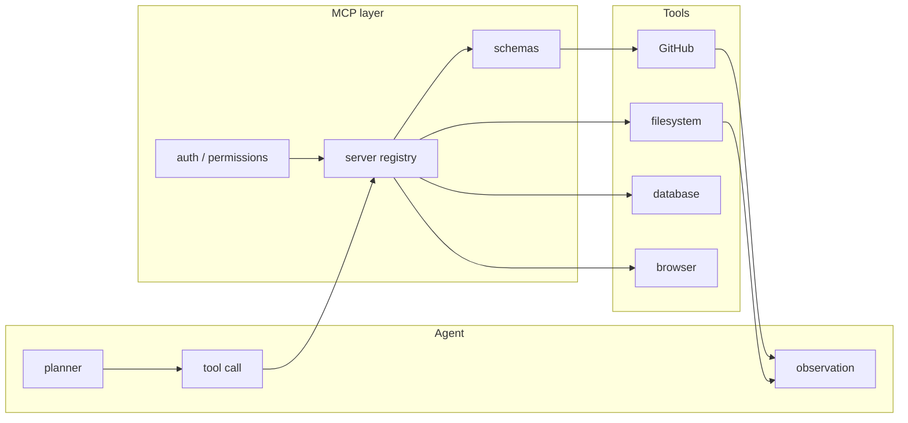
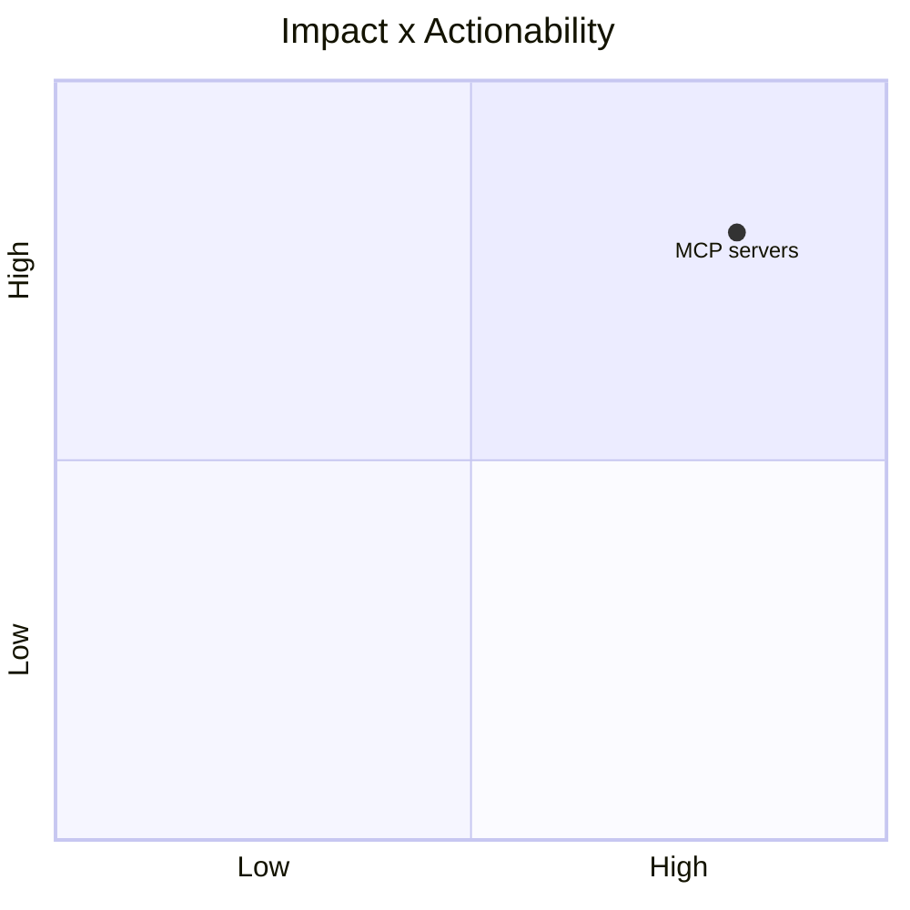

# modelcontextprotocol/servers

> Type: GitHub detail
> Date: 2026-07-13
> Source: https://github.com/modelcontextprotocol/servers
> Return: [[Daily/2026-07-13]]

## One-line Takeaway

MCP servers remain a core integration layer for agent tool-use and coding workflows.

## TL;DR

- What it is: a collection of Model Context Protocol servers.
- Why it matters: standardizes how agents connect to tools, data, and services.
- Action: watch server quality, auth patterns, and sandbox implications.

## Metadata

| Field | Value |
|---|---|
| Source | GitHub |
| Source type | repo / direct watched fallback |
| Original | [repo](https://github.com/modelcontextprotocol/servers) |
| Daily | [[Daily/2026-07-13]] |

## Diagram

## Professional Notes

MCP affects agent reliability, blast radius, and tool observability. It is high relevance for coding-agent loop design.

## Follow-up

1. Track official server changes.
2. Audit permission boundaries.
3. Map useful servers to Hermes/Codex workflows.

#ai-radar #mcp #agent
