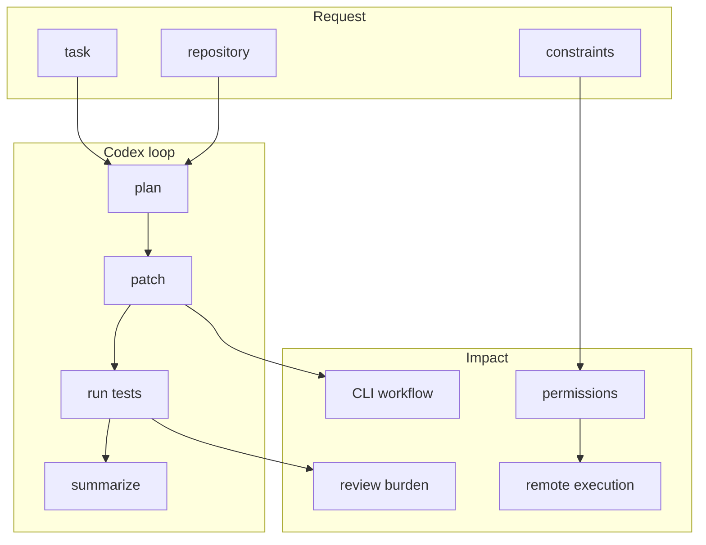
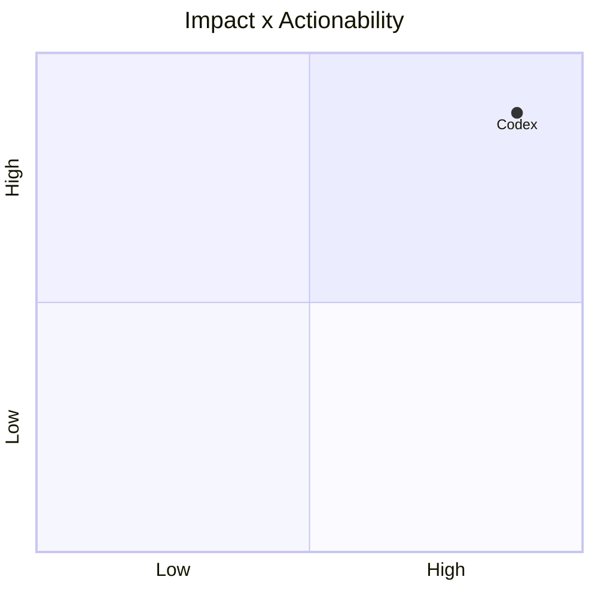

# openai/codex

> Type: GitHub detail
> Date: 2026-07-13
> Source: https://github.com/openai/codex
> Return: [[Daily/2026-07-13]]

## One-line Takeaway

OpenAI Codex is today's strongest watched coding-agent growth signal.

## TL;DR

- What it is: a lightweight terminal coding agent.
- Why it matters: it shapes CLI/TUI agent permissions, context, and remote execution patterns.
- Action: watch changelog and compare with Claude Code.

## Metadata

| Field | Value |
|---|---|
| Source | GitHub |
| Source type | repo / direct watched fallback |
| Original | [repo](https://github.com/openai/codex) |
| Daily | [[Daily/2026-07-13]] |

## Diagram

## Professional Notes

The growth number in the daily is direct watched-repo delta, not all-GitHub ranking. It remains a must-watch tool for AI coding workflow design.

## Follow-up

1. Check latest releases and docs.
2. Track sandbox and approval defaults.
3. Compare with Claude Code and Gemini CLI.

#ai-radar #codex #coding-agent
