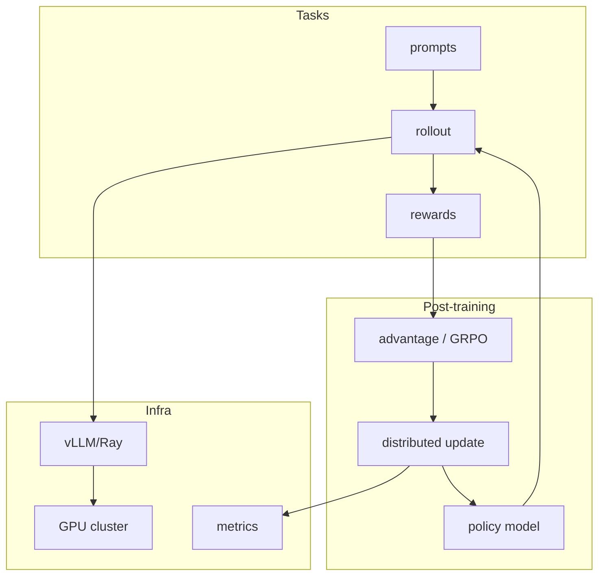
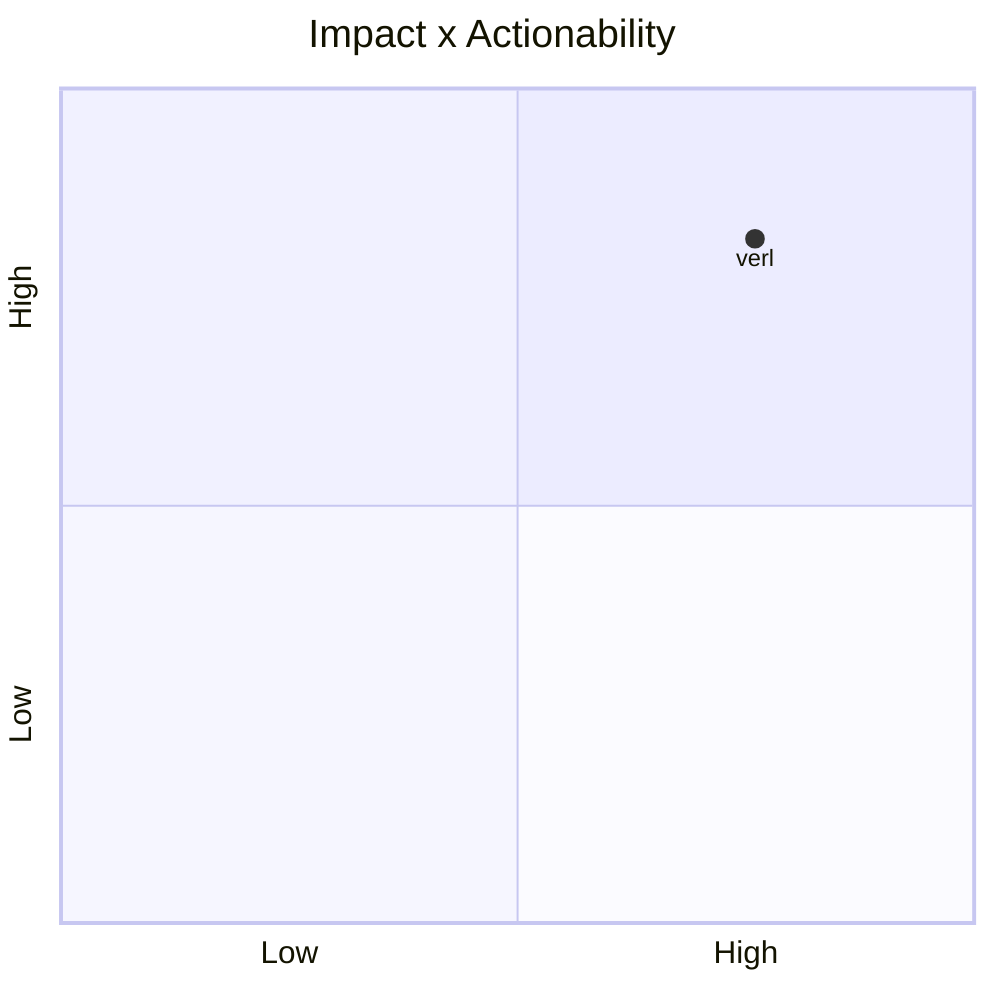

# verl-project/verl

> Type: GitHub detail
> Date: 2026-07-13
> Source: https://github.com/verl-project/verl
> Return: [[Daily/2026-07-13]]

## One-line Takeaway

verl is a core open-source framework for RL post-training workflows.

## TL;DR

- What it is: HybridFlow RL post-training framework.
- Why it matters: relevant to GRPO/PPO style LLM training pipelines.
- Action: watch integration with vLLM/Ray and distributed rollout design.

## Metadata

| Field | Value |
|---|---|
| Source | GitHub |
| Source type | repo / direct watched fallback |
| Original | [repo](https://github.com/verl-project/verl) |
| Daily | [[Daily/2026-07-13]] |

## Diagram

## Professional Notes

verl is highly relevant for scalable RLHF/RLAIF/post-training systems and should stay on the radar even when GitHub Search is limited.

## Follow-up

1. Check examples and supported algorithms.
2. Map rollout/eval needs to your RL game training stack.
3. Track production-readiness and cluster requirements.

#ai-radar #rlhf #post-training
