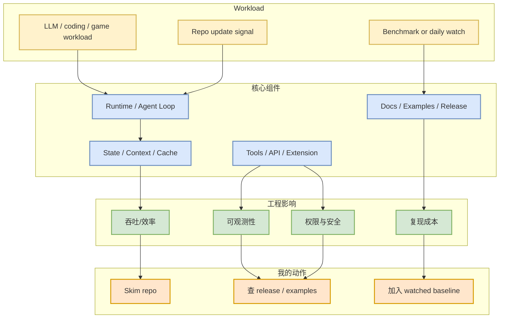
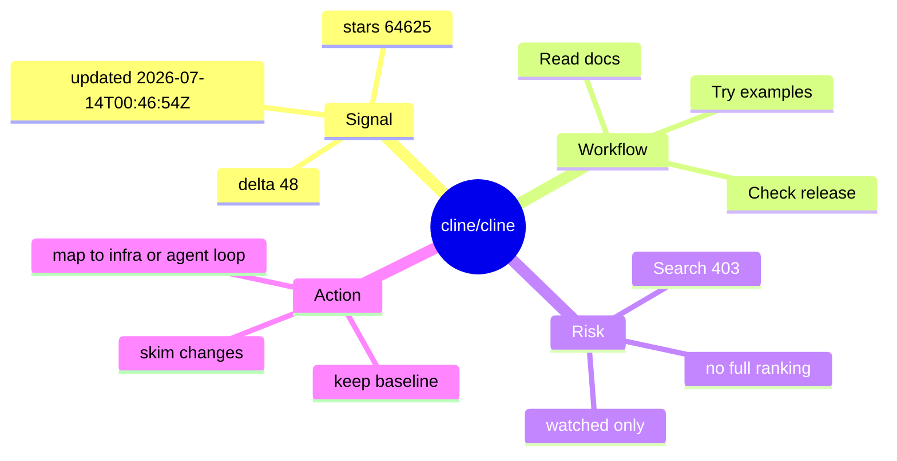

# cline/cline - 2026-07-14

> 一句话结论：Autonomous coding agent as an SDK, IDE extension, or CLI assistant.

## TL;DR

- 来源：GitHub direct `GET /repos` fallback；GitHub Search 今日 403，所以这是 watched repo 信号，不是完整全网排名。
- stars / forks：64625 / 6908；delta：48（direct GET /repos fallback vs 2026-07-13 snapshot; 非完整全网日增）。
- 更新时间：2026-07-14T00:46:54Z；语言：TypeScript；topics：无。
- 原文：https://github.com/cline/cline

## 元信息表

| 字段 | 内容 |
|---|---|
| Repo | `cline/cline` |
| 来源类型 | GitHub Repository / direct fallback |
| stars | 64625 |
| forks | 6908 |
| language | TypeScript |
| updated_at | 2026-07-14T00:46:54Z |
| themes | loop_engineer |
| 原文 | https://github.com/cline/cline |

## 信息压缩图示

## 机制 / 影响矩阵

| 维度 | 观察点 | 对我的影响 |
|---|---|---|
| AI Infra | runtime、吞吐、GPU/模型适配或框架生态 | 判断 serving/training 选型是否需要跟进 |
| Agent Loop | CLI、IDE、MCP、工具调用、上下文窗口 | 影响多 agent 编码、审查和权限边界设计 |
| RL / Game AI | 状态机、rollout、reward、evaluator | 可复用到 Point Rummy 仿真和 bot 评测 |
| 风险 | direct fallback 非完整全网搜索 | 不能把 delta 当作全 GitHub 日增 |

## 专业解读

Autonomous coding agent as an SDK, IDE extension, or CLI assistant. 由于 GitHub Search 今天从第一批查询开始 403，本条的价值在于“可比 watched baseline”，而不是发现全网新项目。对 AI Infra 工程师来说，稳定 watched repo 能避免 daily radar 被 rate limit 清空；对 Loop Engineer 来说，stars_delta 和 pushed_at 仍能提示哪些 coding-agent 工具值得继续看 release notes、权限模式和上下文策略。

## 通俗解释

今天不是全网大扫除成功，而是用固定观察名单检查这些关键项目有没有继续升温。这个项目如果持续增长或活跃，就像雷达上的稳定亮点：不一定说明它今天发布了大功能，但值得你保留在技术选型和周度深挖列表里。

## 关键机制拆解

## 对我的影响

- 如果它属于 serving/training：重点看 scheduler、KV cache、GPU runtime、distributed training 或 post-training integration。
- 如果它属于 coding agent：重点看 CLI/TUI、MCP、权限模式、远程执行、repo 上下文与代码审查 loop。
- 如果它属于 Rummy/Game AI：重点抽取规则状态机、仿真接口、AI opponent、MCTS/RL 与 evaluator。

## 可信度与局限性

- 可信：repo 元数据来自 GitHub direct API。
- 局限：GitHub Search 403，不能代表完整全网 Top / growth。
- 局限：stars_delta 来自前一日 snapshot 对比，仅对 watched repo 集合有效。

## 我应该如何跟进

1. 打开 repo release / docs，确认是否有真正功能变化。
2. 若涉及 serving 或 coding agent，抽一个最小 example 做 30 分钟试用。
3. 把有价值的机制整理进周度选型或 Point Rummy environment 设计。

## 相关链接

- 原文：https://github.com/cline/cline
- 今日日报：[[Daily/2026-07-14]]

#ai-radar #github #ai-infra #loop-engineering #point-rummy
