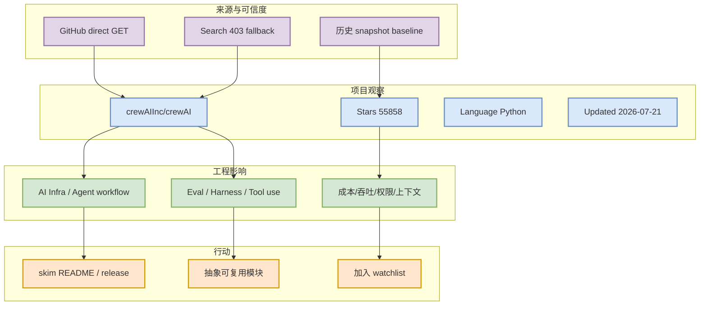

# crewAIInc/crewAI

> 日期：2026-07-21
> 来源：GitHub direct watched repo fallback
> 主题：Loop Engineer

## 一句话结论

多角色 agent 编排框架，适合横向比较 multi-agent loop 抽象。 今日作为 watched repo fallback 被纳入；由于 GitHub Search 403，它不是完整全网排名，但元数据来自 direct repo GET。

## TL;DR

- repo：`crewAIInc/crewAI`
- stars / forks：55858 / 7892
- language：Python
- updated_at：2026-07-21T00:53:41Z
- stars_delta：63，口径为 direct watched repo fallback vs historical snapshot，非完整全网日增。
- 原文：https://github.com/crewAIInc/crewAI

## 元信息表

| 字段 | 值 |
|---|---|
| 来源 | GitHub |
| 来源类型 | Repository metadata / direct fallback |
| repo | `crewAIInc/crewAI` |
| stars | 55858 |
| forks | 7892 |
| language | Python |
| topics | agents, ai, ai-agents, aiagentframework, llms |
| description | Framework for orchestrating role-playing, autonomous AI agents. By fostering collaborative intelligence, CrewAI empowers agents to work together seamlessly, tackling complex tasks. |
| 原文链接 | [https://github.com/crewAIInc/crewAI](https://github.com/crewAIInc/crewAI) |

## 信息压缩图示

## 影响矩阵

| 维度 | 判断 | 原因 |
|---|---|---|
| AI Infra 相关性 | 中高 | 多角色 agent 编排框架，适合横向比较 multi-agent loop 抽象。 |
| 生产可用性 | 中 | 需要复核 README、release、benchmark 和 issue 活跃度。 |
| 今日新鲜度 | 中低 | direct metadata 当前，但不是完整搜索发现的新项目。 |
| 跟进行动 | 加入 watchlist | 后续优先看 release notes、benchmark、examples。 |

## 专业解读

多角色 agent 编排框架，适合横向比较 multi-agent loop 抽象。 对用户最有价值的不是单日 star 变化，而是它在 serving、training、agent loop、tool-use 或 Rummy/game-AI 环节中提供的可复用工程抽象。今天 GitHub Search 403，因此日报明确使用 watched repo fallback，避免把 fallback 排名误读为全网真实热度。

## 通俗解释

这相当于在全网搜索暂时不可用时，先看一组固定的重点项目体检表：谁还活跃、谁增长明显、谁值得今天抽时间 skim。

## 关键机制拆解

| 模块 | 可借鉴点 | 风险 |
|---|---|---|
| Repo 活跃度 | stars/forks/updated_at 作为弱信号 | star 不是质量保证 |
| 工程接口 | README/examples/release 可能可复用 | 需要真实试跑验证 |
| 生态位置 | 与 LLM serving、agent loop、RL post-training 或 Rummy 业务相关 | fallback 覆盖面有限 |

## 对我的影响

- AI Infra：关注是否影响 serving/runtime/training/eval 的选型。
- AI coding workflow：关注是否影响 CLI/TUI、MCP、agent loop、权限、上下文窗口。
- RL/Game AI：若是 Rummy 相关，优先抽规则状态机、bot、evaluator，而不是直接复用生产代码。

## 可信度与局限性

- 可信度：中；GitHub direct GET 元数据可信。
- 局限性：GitHub Search 今日 403，排名是 watched repo fallback，不代表完整全网 Top 10。
- 待确认：release notes、benchmark、docs/examples 与最新功能变更。

## 我应该如何跟进

1. skim README / releases。
2. 若涉及 serving 或 coding agent，抽取架构图和权限/调度模型。
3. 若涉及 Rummy，复核规则是否贴合 Indian/Point Rummy。

## 相关链接

- GitHub：[https://github.com/crewAIInc/crewAI](https://github.com/crewAIInc/crewAI)
- Daily：[[Daily/2026-07-21]]

#ai-radar #github #fallback
