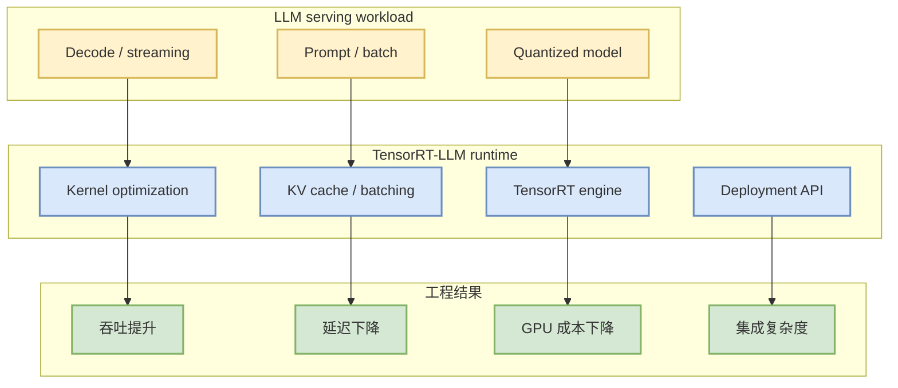

# NVIDIA/TensorRT-LLM

> 一句话结论：NVIDIA TensorRT-LLM 仍是生产 LLM 推理优化的关键 watched repo，今日作为 direct watched-repo fallback 纳入观察。

## TL;DR
- 来源：GitHub repo / NVIDIA AI Infra 生态。
- 来源类型：GitHub repo / direct watched fallback。
- 原文：https://github.com/NVIDIA/TensorRT-LLM
- 重点：关注 GPU kernel、量化、batching、KV cache、serving runtime 与生产部署性能。

## 元信息
| 字段 | 内容 |
|---|---|
| 大类 | GitHub / AI Infra |
| Repo | NVIDIA/TensorRT-LLM |
| 来源类型 | GitHub repo / direct watched fallback |
| 日报 | [[Daily/2026-07-22]] |
| 原文 | [GitHub](https://github.com/NVIDIA/TensorRT-LLM) |

## 信息压缩图示

## 影响矩阵
| 维度 | 判断 | 说明 |
|---|---|---|
| Serving | 高 | 直接影响 NVIDIA GPU 上的 LLM 推理性能。 |
| Training | 中 | 主要是推理栈，但会影响模型导出和部署约束。 |
| Agent | 中 | Agent 高并发推理成本依赖 serving 性能。 |
| 风险 | 中 | 集成复杂度和版本兼容性需要验证。 |

## 专业解读
TensorRT-LLM 的价值在于把模型结构、GPU kernel、量化和 runtime 编排连接起来。对于 AI Infra 工程，重点不是 star 数，而是它是否能在目标模型、目标 GPU 和目标延迟约束下稳定降低成本。

## 我应该如何跟进
1. 对比 vLLM / SGLang / TensorRT-LLM 在同一模型上的吞吐与延迟。
2. 检查当前 GPU 架构、CUDA、TensorRT 版本兼容性。
3. 只在有明确生产性能收益时投入深度集成。

## 标签
#ai-radar #github #ai-infra #serving
