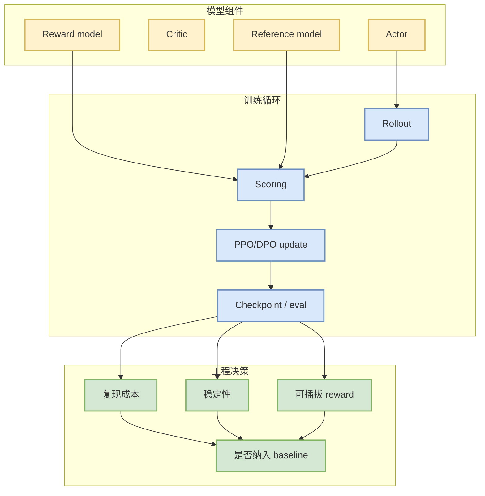

# OpenRLHF/OpenRLHF

> 一句话结论：OpenRLHF 是开源 RLHF baseline，适合和 verl 一起作为 post-training / reward pipeline 的对照观察项。

## TL;DR
- 来源：GitHub repo。
- 来源类型：GitHub repo / direct watched fallback。
- 原文：https://github.com/OpenRLHF/OpenRLHF
- 重点：PPO、DPO、reward model、distributed RLHF pipeline。

## 元信息
| 字段 | 内容 |
|---|---|
| 大类 | GitHub / Post-training |
| Repo | OpenRLHF/OpenRLHF |
| 来源类型 | GitHub repo / direct watched fallback |
| 日报 | [[Daily/2026-07-22]] |
| 原文 | [GitHub](https://github.com/OpenRLHF/OpenRLHF) |

## 信息压缩图示

## 影响矩阵
| 维度 | 判断 | 说明 |
|---|---|---|
| RLHF | 高 | 适合作为 PPO/DPO/RM pipeline baseline。 |
| Game AI | 中 | 可借鉴 reward 与 rollout loop，但需要重写环境接口。 |
| 可落地性 | 中 | 依赖 examples、硬件和任务适配。 |
| 风险 | 中 | 分布式稳定性和数据质量仍需验证。 |

## 专业解读
OpenRLHF 的价值在于提供可读的 RLHF pipeline baseline。和 verl 对比时，应重点看 rollout 并行、reward model 接口、训练稳定性、成本和可观测性。

## 我应该如何跟进
1. 和 verl 对比 API、配置、训练稳定性。
2. 选一个小模型跑通 PPO/DPO smoke test。
3. 抽象 reward/evaluator 接口，为游戏 RL 复用做准备。

## 标签
#ai-radar #github #rlhf #post-training
