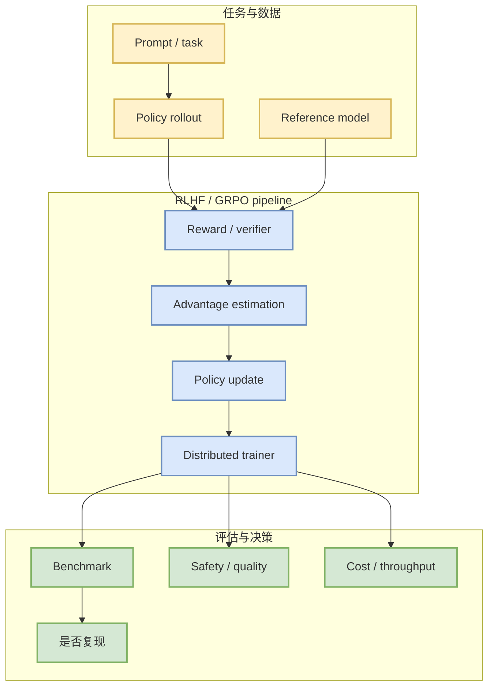

# volcengine/verl

> 一句话结论：verl 是 LLM post-training / RLHF / GRPO 方向的关键开源框架，适合持续观察 rollout、reward、trainer 和分布式执行设计。

## TL;DR
- 来源：GitHub repo。
- 来源类型：GitHub repo / direct watched fallback。
- 原文：https://github.com/volcengine/verl
- 重点：RLHF、GRPO、PPO、reward pipeline、distributed rollout。

## 元信息
| 字段 | 内容 |
|---|---|
| 大类 | GitHub / Post-training |
| Repo | volcengine/verl |
| 来源类型 | GitHub repo / direct watched fallback |
| 日报 | [[Daily/2026-07-22]] |
| 原文 | [GitHub](https://github.com/volcengine/verl) |

## 信息压缩图示

## 影响矩阵
| 维度 | 判断 | 说明 |
|---|---|---|
| Post-training | 高 | 直接映射到 PPO/GRPO/RLHF pipeline。 |
| RL 游戏模型 | 中高 | rollout、reward、env 并行思想可迁移到 game agent。 |
| Serving | 中 | rollout 需要高吞吐推理后端配合。 |
| 风险 | 中 | 需要验证稳定性、示例完整度和分布式成本。 |

## 专业解读
verl 的核心观察点是能否把 rollout、reward、advantage、policy update 和分布式执行做成可替换模块。对于用户的 RLHF 与游戏 RL 背景，它比单篇论文更接近可落地工程。

## 我应该如何跟进
1. 阅读 examples 中 GRPO / PPO 配置。
2. 看是否能接入现有 serving 后端和自定义 reward。
3. 评估能否迁移到 Point Rummy self-play / evaluator pipeline。

## 标签
#ai-radar #github #post-training #rlhf #grpo
