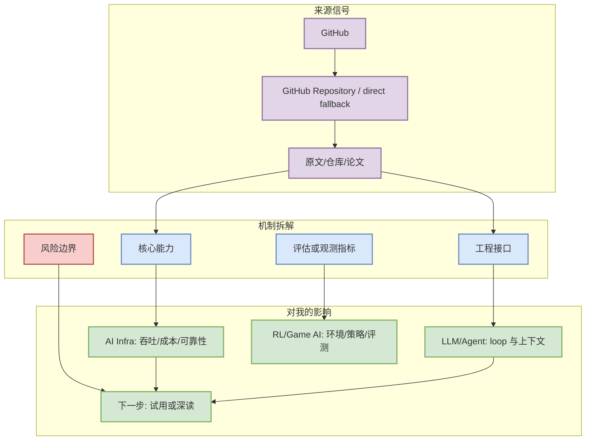
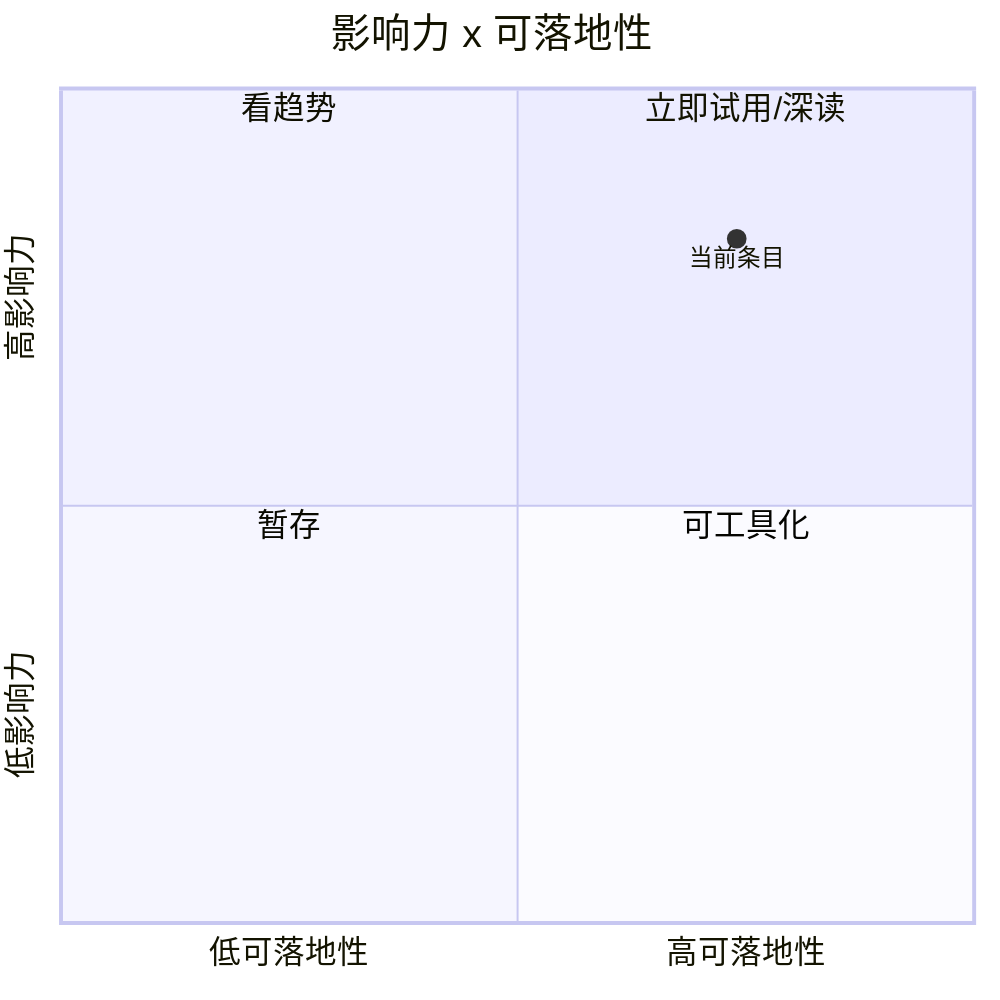

# OpenHands/OpenHands

> 类型：GitHub Repository / direct fallback
> 大类：AI Radar
> 小类：AI Infra / Agent
> 推荐等级：必读/后续
> 创建日期：2026-07-23
> 原文链接：https://github.com/OpenHands/OpenHands
> 网页详情：https://github.com/dyt27666-oss/AI-news-report-obsidians/blob/main/GitHub/AIInfra/2026-07-23/openhands-openhands.md
> 返回日报：[[Daily/2026-07-23]]

## 一句话结论

🙌 OpenHands: AI-Driven Development

## TL;DR

- **它是什么**：GitHub 的今日高信号条目。
- **为什么重要**：该仓库在 watched repo 集合中仍有可观 star 基数/增量；对用户的 serving、agent loop 或 coding workflow 有直接参考价值。增长依据：direct watched-repo fallback vs 2026-07-22 snapshot; 非完整全网日增
- **和我相关的点**：可映射到 AI Infra、LLM 工程、Agent loop 或 Point Rummy/Game AI 的实现决策。
- **建议动作**：先读元信息和图示，再决定是否试用、复现或加入 watchlist。

## 元信息

| 字段 | 内容 |
|---|---|
| 发布方/来源 | GitHub |
| 栏目/来源类型 | GitHub Repository / direct fallback |
| 发布时间 | 2026-07-23 或源站最新更新时间 |
| 原文 | [原文](https://github.com/OpenHands/OpenHands) |
| 代码 | https://github.com/OpenHands/OpenHands |
| PDF | 未发现 |
| 标签 | #ai-radar #ai-infra-agent |

## 信息压缩图示

## 专业解读

该仓库在 watched repo 集合中仍有可观 star 基数/增量；对用户的 serving、agent loop 或 coding workflow 有直接参考价值。增长依据：direct watched-repo fallback vs 2026-07-22 snapshot; 非完整全网日增 重点不是“又一个新闻”，而是它暴露了当前工程系统的优先级：agent 工具在争夺 terminal/IDE 控制面，serving/training 项目继续围绕吞吐、显存、调度和可观测性演进，Game AI/Rummy 主题则需要把规则、状态抽象、自博弈和评测闭环拆成可复用模块。

## 通俗解释

可以把它看成一个提醒：今天应该把注意力放在能实际改变开发、训练或推理流程的东西上，而不是泛泛追热点。

## 关键机制拆解

| 机制 | 解决的问题 | 为什么有效 | 可能的坑 |
|---|---|---|---|
| 来源信号筛选 | 避免噪声 | 只保留强相关主题 | API 失败会降低覆盖率 |
| 工程映射 | 从新闻到行动 | 连接到 serving/training/agent/RL 工作 | 需要后续实测 |
| 详情页沉淀 | 避免日报过长 | Daily 做导航，详情页做理解 | 需持续维护链接 |

## 对我的影响

| 维度 | 影响 | 建议动作 |
|---|---|---|
| AI Infra | 关注吞吐、调度、显存、部署接口 | 加入 watchlist 或跑最小样例 |
| LLM 工程 | 关注上下文、工具调用、评测闭环 | 对比现有 agent workflow |
| RL / Game AI | 关注环境抽象、自博弈、策略评测 | 提炼到 Point Rummy 模块 |
| Agent / Eval | 关注权限、远程执行、MCP、IDE 集成 | 记录可复用模式 |

## 可信度与局限性

- 证据强度：中等；GitHub Search 今日 403，GitHub 榜单使用 direct watched-repo fallback。
- 局限性：大厂博客源以扫描矩阵透明记录，未把访问失败伪装成新内容。
- 还需要确认：具体 release notes 和论文实验细节需后续深读。

## 我应该如何跟进

1. 打开原文验证最新 release / paper version。
2. 若是工具或 infra repo，跑 hello-world 或查看 benchmark。
3. 若与 Rummy/Loop Engineering 相关，抽象成规则、评测或 agent-loop checklist。

## 相关链接

- 原文：https://github.com/OpenHands/OpenHands
- 网页详情：https://github.com/dyt27666-oss/AI-news-report-obsidians/blob/main/GitHub/AIInfra/2026-07-23/openhands-openhands.md
- 返回日报：[[Daily/2026-07-23]]

## 标签

#ai-radar #ai-infra-agent
