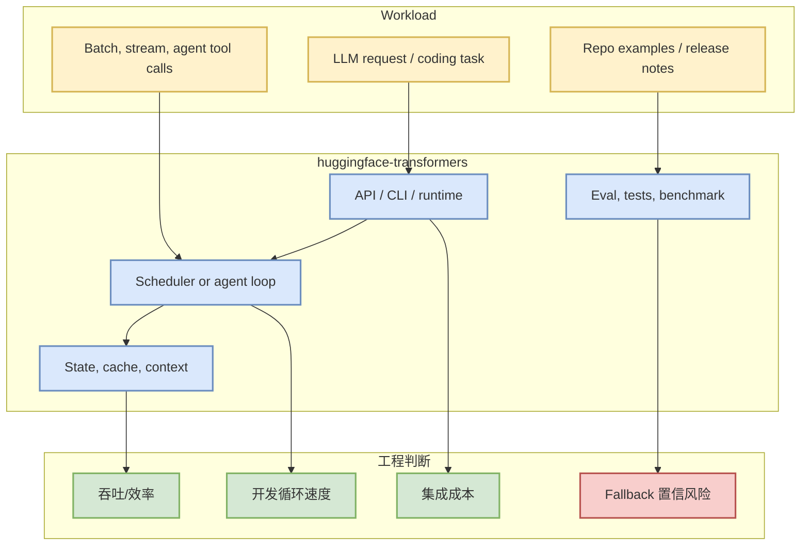
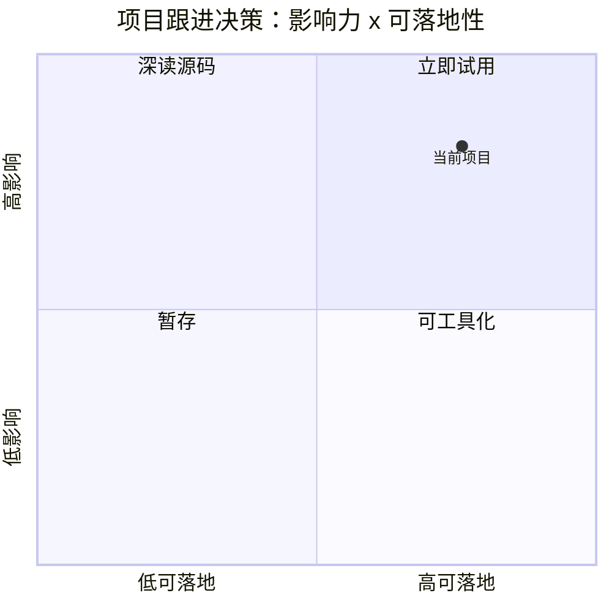

# huggingface/transformers

> 类型：GitHub 项目
> 大类：GitHub
> 小类：AIInfra
> 推荐等级：可 skim
> 创建日期：2026-07-28
> 原文链接：https://github.com/huggingface/transformers
> 网页详情：https://github.com/dyt27666-oss/AI-news-report-obsidians/blob/main/GitHub/AIInfra/2026-07-28/huggingface-transformers.md
> 返回日报：[[Daily/2026-07-28]]

## 一句话结论

huggingface/transformers 是今日 direct watched-repo fallback 里的关键观察对象；本页用于在 GitHub Search 403 时保留可追踪的 AI Infra / Agent loop 线索。

## TL;DR

- **它是什么**：🤗 Transformers: the model-definition framework for state-of-the-art machine learning models in text, vision, audio, and multimodal models, f
- **为什么重要**：它处在 serving、training、agent loop、MCP 或 coding workflow 的关键路径上。
- **和我相关的点**：stars=163008，delta=None，language=Python，适合持续观察 release、issues、benchmark 与 examples。
- **建议动作**：不要把 fallback 增长当作全站排名；优先看 README、release、benchmarks 和是否能接入现有工程。

## 元信息

| 字段 | 内容 |
|---|---|
| repo | [huggingface/transformers](https://github.com/huggingface/transformers) |
| stars / forks | 163008 / 34026 |
| language | Python |
| updated_at | 2026-07-28T00:50:56Z |
| topics | audio, deep-learning, deepseek, gemma, glm, hacktoberfest, llm, machine-learning, model-hub, natural-language-processing, nlp, pretrained-models, python, pytorch, pytorch-transformers, qwen, speech-recognition, transformer, vlm |
| stars_delta | None |
| 增长依据 | direct watched-repo fallback; baseline missing |

## 信息压缩图示

### 辅助图：采用决策

## 专业解读

该仓库被纳入固定 watched repo，是为了在 GitHub Search 被限流时仍能持续跟踪 AI Infra 和 coding-agent 关键依赖。对于 AI Infra，重点不是单日 star，而是其是否提供稳定 runtime、scheduler、cache、kernel、benchmark、release cadence 和生产部署路径。对于 coding-agent/Loop Engineer，重点看权限模型、工具调用、上下文压缩、CLI/TUI 体验、IDE 集成和 eval loop。

## 通俗解释

今天的 GitHub 搜索像“雷达天线被限流”，所以改用固定观察名单。这个项目就是名单里的一个重要点位，用来保证日报不会被低相关的小众搜索结果带偏。

## 关键机制拆解

| 机制 | 解决的问题 | 为什么有效 | 可能的坑 |
|---|---|---|---|
| Direct GET fallback | Search API 403 时仍取 repo 元数据 | 单仓库接口常比 Search 更可用 | 不是全站排名 |
| Historical delta | 估算 watchlist 日增 | 与昨日 snapshot 对比 | baseline 缺失会低置信 |
| Detail page | 保持 Obsidian 导航完整 | daily 链接可追溯 | 需要后续补真实 release 阅读 |

## 对我的影响

| 维度 | 影响 | 建议动作 |
|---|---|---|
| AI Infra | 可作为 serving/training/agent infra watchlist | 看 release 与 benchmark |
| LLM 工程 | 可能影响推理、上下文或 agent 工具链 | 跟踪 examples 与 docs |
| RL / Game AI | 间接影响训练环境和评测基础设施 | 暂存，按需借鉴 |
| Agent / Eval | 对 loop、tool use、eval harness 有参考 | 拆权限和测试策略 |

## 可信度与局限性

- 证据强度：中等；来自 GitHub API direct repo 元数据。
- 局限性：今日 GitHub Search 403，榜单不是完整全站排名。
- 潜在风险：stars_delta 只覆盖 watched repo，不代表全 GitHub 增长。
- 还需要确认：最新 release、issue 活跃度、benchmark 是否匹配你的场景。

## 我应该如何跟进

1. 打开原始 repo 检查 release / changelog。
2. 如果是 serving/training 项目，优先找 benchmark、kernel、部署示例。
3. 如果是 coding-agent 项目，重点看权限、MCP、CLI/IDE、eval loop。

## 相关链接

- 原文：https://github.com/huggingface/transformers
- 网页详情：https://github.com/dyt27666-oss/AI-news-report-obsidians/blob/main/GitHub/AIInfra/2026-07-28/huggingface-transformers.md
- 返回日报：[[Daily/2026-07-28]]

## 标签

#ai-radar #github #aiinfra #fallback
