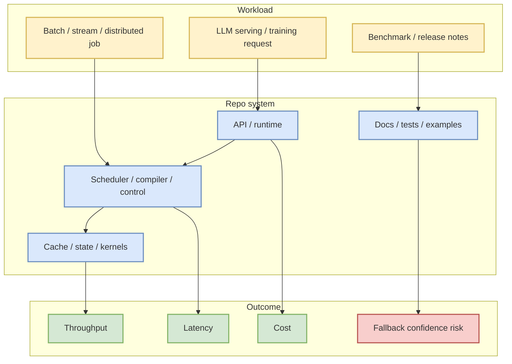
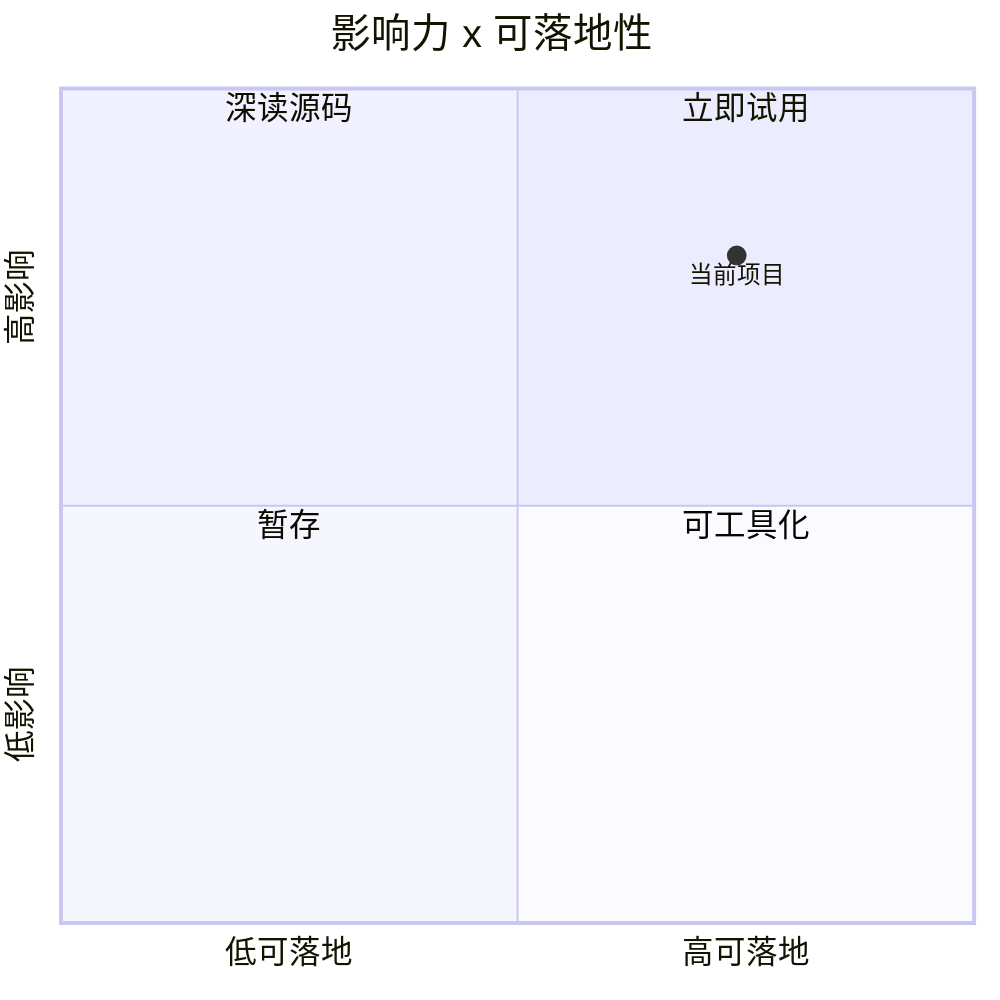

# sgl-project/sglang

> 类型：GitHub 项目
> 大类：GitHub
> 小类：AIInfra
> 推荐等级：可 skim
> 创建日期：2026-07-28
> 原文链接：https://github.com/sgl-project/sglang
> 网页详情：https://github.com/dyt27666-oss/AI-news-report-obsidians/blob/main/GitHub/AIInfra/2026-07-28/sgl-project-sglang.md
> 返回日报：[[Daily/2026-07-28]]

## 一句话结论

sgl-project/sglang 是今日 direct watched-repo fallback 中的 AI Infra 观察对象，用于补齐 Search 403 时的 serving/training/runtime 视图。

## TL;DR

- **它是什么**：SGLang is a high-performance serving framework for large language models and multimodal models.
- **为什么重要**：它位于 LLM serving、distributed runtime、kernel/compiler 或 training stack 的关键路径。
- **和我相关的点**：stars=30770，forks=7408，language=Python，updated_at=2026-07-28T00:03:48Z。
- **建议动作**：查看 release、benchmark、examples 和生产部署约束。

## 元信息

| 字段 | 内容 |
|---|---|
| repo | [sgl-project/sglang](https://github.com/sgl-project/sglang) |
| stars / forks | 30770 / 7408 |
| language | Python |
| updated_at | 2026-07-28T00:03:48Z |
| topics | attention, blackwell, cuda, deepseek, diffusion, glm, gpt-oss, inference, llama, llm, minimax, moe, qwen, qwen-image, reinforcement-learning, transformer, vlm, wan |
| stars_delta | 95 |
| 增长依据 | direct watched-repo fallback + cross-snapshot historical baseline; non-complete all-GitHub daily growth |

## 信息压缩图示

### 辅助图：采用决策

## 专业解读

该页是为修复当日 Daily 中的必需 wikilink 而生成的 concise detail。Search API 被限流时，direct watched-repo fallback 能保留关键基础设施项目的连续观测，但不能代表完整 GitHub 全站趋势。阅读时应重点看 benchmark、release cadence、issue 活跃度、硬件依赖和集成成本。

## 通俗解释

这是固定雷达名单里的基础设施项目卡片，用来保证日报导航不断链。

## 关键机制拆解

| 机制 | 解决的问题 | 为什么有效 | 可能的坑 |
|---|---|---|---|
| Direct GET | Search 403 时取单 repo 元数据 | 来源稳定可追溯 | 非全站排名 |
| Snapshot delta | 估算 watchlist 增长 | 可跨天对比 | baseline 可能缺失 |
| Detail card | 修复 Obsidian 导航 | 可点击深挖 | 仍需读源码和 release |

## 对我的影响

| 维度 | 影响 | 建议动作 |
|---|---|---|
| AI Infra | serving/training/runtime 观察 | 看 benchmark |
| LLM 工程 | 影响部署或开发效率 | 看 examples |
| RL / Game AI | 可借鉴 distributed/runtime 组件 | 暂存 |
| Agent / Eval | 可作为 harness 依赖 | 按需试用 |

## 可信度与局限性

- 证据强度：中等，来自 GitHub API 元数据。
- 局限性：Search 403，榜单为 fallback。
- 潜在风险：未读最新 release 全文。
- 还需要确认：性能数据、license、部署成本。

## 我应该如何跟进

1. 检查 release 和 benchmark。
2. 对照当前 serving/training stack 评估迁移成本。
3. 记录适合复现的最小 demo。

## 相关链接

- 原文：https://github.com/sgl-project/sglang
- 网页详情：https://github.com/dyt27666-oss/AI-news-report-obsidians/blob/main/GitHub/AIInfra/2026-07-28/sgl-project-sglang.md
- 返回日报：[[Daily/2026-07-28]]

## 标签

#ai-radar #github #aiinfra #fallback
