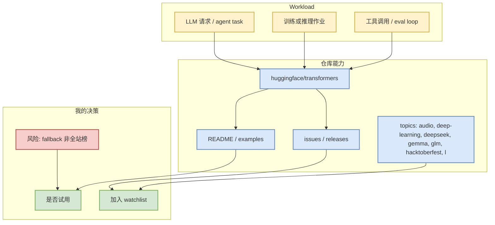

# huggingface/transformers - 2026-07-31

> 来源类型：GitHub Repo / direct GET fallback  
> 原文：https://github.com/huggingface/transformers  
> 可信度：中；GitHub Search 今日部分 403，本页来自 direct repo API。

## 一句话结论
huggingface/transformers 是今日 AIInfra watchlist 的关键节点；当前数据适合用于工程跟踪，不应解读为完整 GitHub 全站排名。

## TL;DR
- Stars/Forks：163180 / 34081；语言：Python。
- 最近更新：2026-07-31T00:21:08Z；topics：audio, deep-learning, deepseek, gemma, glm, hacktoberfest, llm, machine-learning, model-hub, natural-language-processing。
- 重点：🤗 Transformers: the model-definition framework for state-of-the-art machine learning models in text, vision,...
- 对我的影响：用于观察 serving、training、agent loop 或 coding workflow 的生产化方向。

## 元信息表
| 字段 | 值 |
|---|---|
| repo | `huggingface/transformers` |
| stars | 163180 |
| forks | 34081 |
| language | Python |
| updated_at | 2026-07-31T00:21:08Z |
| stars_delta | 51 |
| 来源类型 | GitHub direct repo API / fallback |
| 原文 | https://github.com/huggingface/transformers |

## 信息压缩图示

## 影响矩阵
| 维度 | 判断 | 说明 |
|---|---|---|
| AI Infra | 中到高 | 若仓库涉及 runtime、serving、training 或 model stack，可进入工程观察。 |
| Agent / Loop | 中 | 若仓库涉及 CLI、MCP、agent loop 或 eval，可影响 AI coding 工作流。 |
| 可复现性 | 中 | 需进一步检查 docs、examples、benchmark。 |
| 风险 | 中 | 今日 broad GitHub Search 403，排名来自 direct watched-repo fallback。 |

## 专业解读
该仓库被放入固定 watchlist，是因为它与 LLM serving/training/agent workflow 的生产化路径相关。今天的核心价值不是“发现新仓库”，而是在 GitHub Search 限流时保持可追溯、可比较的核心工程面。

## 通俗解释
把它当成每天固定看的仪表盘指标：即使全网搜索失败，仍能知道核心工具链有没有明显变化。

## 我应该如何跟进
1. 打开 release/issues 检查是否有性能、权限、MCP、上下文、部署相关变化。
2. 若与当前工作栈重合，拉取示例或 benchmark 做一次小规模复现。
3. 明天用新 snapshot 继续比较 stars_delta，避免单日噪声。

## 相关链接
- 原文：https://github.com/huggingface/transformers
- 今日日报：[[Daily/2026-07-31]]

#ai-radar #github #fallback #aiinfra
