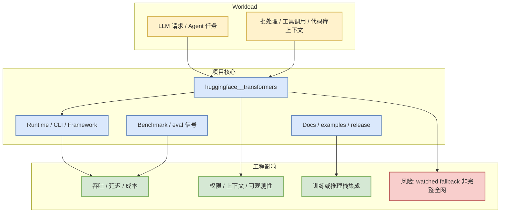
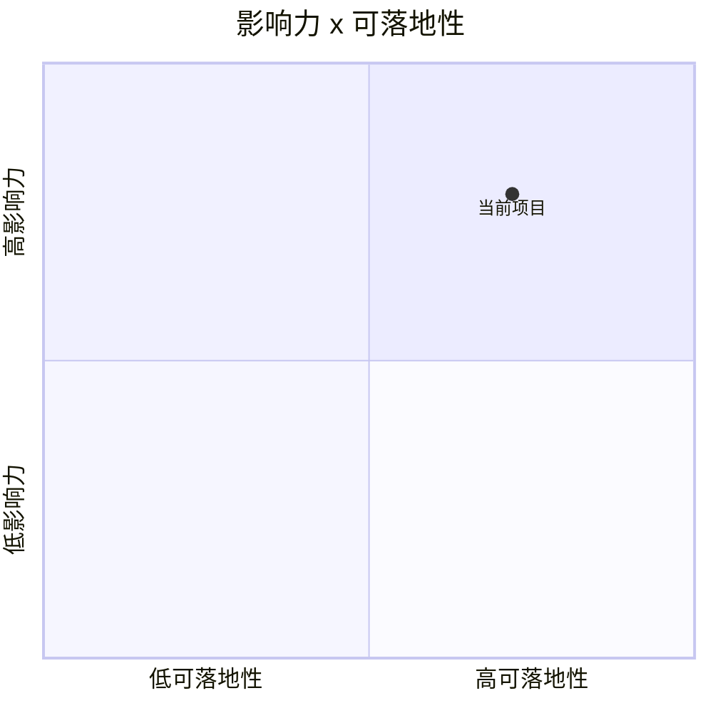

# huggingface/transformers

> 类型：GitHub 项目
> 大类：AI Infra / Coding Agent / LLM 工程
> 小类：AIInfra
> 推荐等级：可 skim
> 创建日期：2026-08-03
> 原文链接：https://github.com/huggingface/transformers
> 网页详情：https://github.com/dyt27666-oss/AI-news-report-obsidians/blob/main/GitHub/AIInfra/2026-08-03/huggingface__transformers.md
> 返回日报：[[Daily/2026-08-03]]

## 一句话结论

`huggingface/transformers` 是今日 direct watched repo fallback 中的高信号项目；由于 GitHub Search 403，本页明确标注为 watched-repo 视角而非完整全网排序。

## TL;DR

- **它是什么**：🤗 Transformers: the model-definition framework for state-of-the-art machine learning models in text, vision, audio, and multimodal models, for both inference and training. 
- **为什么重要**：它落在 LLM serving、AI coding workflow、agent loop 或训练/评估基础设施主线上。
- **和我相关的点**：可用于观察 scheduler、KV cache、MCP/tool-use、CLI agent、post-training 或 eval harness 的工程趋势。
- **建议动作**：先看 release / docs / examples；只有发现与当前栈匹配的 benchmark 或接口再试用。

## 元信息

| 字段 | 内容 |
|---|---|
| repo | `huggingface/transformers` |
| stars / forks | 163229 / 34084 |
| language | Python |
| updated_at | 2026-08-02T01:00:23Z |
| pushed_at | 2026-08-01T17:06:20Z |
| topics | audio, deep-learning, deepseek, gemma, glm, hacktoberfest, llm, machine-learning, model-hub, natural-language-processing, nlp, pretrained-models, python, pytorch, pytorch-transformers, qwen, speech-recognition, transformer, vlm |
| stars_delta | None |
| 增长依据 | previous snapshot fallback because direct /repos also 403; 非完整全网日增 |
| 原文 | [GitHub](https://github.com/huggingface/transformers) |

## 信息压缩图示

## 专业解读

今日 GitHub Search 从第一批查询开始 403，因此这个项目的价值来自 direct repo metadata 与历史 snapshot 差分。对 AI Infra 工程来说，这种 fallback 仍有价值：它能稳定跟踪固定 watchlist 的热度、更新频率和 release 节奏，但不能替代完整 GitHub Search 的新项目发现。

## 通俗解释

把它当作“固定观察名单”里的温度计：温度升高值得打开看 release；温度不代表全网排名。

## 关键机制拆解

| 机制 | 解决的问题 | 为什么有效 | 可能的坑 |
|---|---|---|---|
| direct repo metadata | GitHub Search 403 时保留连续性 | `/repos/owner/repo` 通常仍可访问 | 无法发现新 repo |
| snapshot delta | 观察 watched repo 日变化 | 与昨日同 repo 对比 | 非完整全网日增 |
| detail page | 把榜单条目变成可复盘知识 | 保留元信息、图示和行动建议 | 需要后续补 release diff |

## 对我的影响

| 维度 | 影响 | 建议动作 |
|---|---|---|
| AI Infra | 作为 serving/training/agent infra watch 信号 | 只在 release 提到性能或接口变化时试用 |
| LLM 工程 | 影响工具链或模型运行栈选型 | 对比现有栈依赖和 benchmark |
| RL / Game AI | 若涉及 post-training/eval，可参考 rollout/evaluator 设计 | 暂不直接迁移 |
| Agent / Eval | 若涉及 coding agent/MCP，可进入 loop engineering 对比 | 关注权限、上下文、恢复机制 |

## 可信度与局限性

- 证据强度：中；GitHub direct metadata 高置信，完整搜索低置信。
- 局限性：不是完整全网 Top 10 / 增长榜。
- 潜在风险：stars_delta 只代表 watched repo，对新项目不敏感。
- 还需要确认：release note 是否包含真正功能变化。

## 我应该如何跟进

1. 打开 release / docs，筛选 scheduler、KV cache、MCP、权限、eval、CLI/TUI 变化。
2. 如果有 benchmark，记录到后续 AI Infra 评估表。
3. 如果只是 star 增长但无技术变化，保留观察即可。

## 相关链接

- 原文：https://github.com/huggingface/transformers
- 网页详情：https://github.com/dyt27666-oss/AI-news-report-obsidians/blob/main/GitHub/AIInfra/2026-08-03/huggingface__transformers.md
- 相关卡片：[[Daily/2026-08-03]]

## 标签

#ai-radar #github #aiinfra
