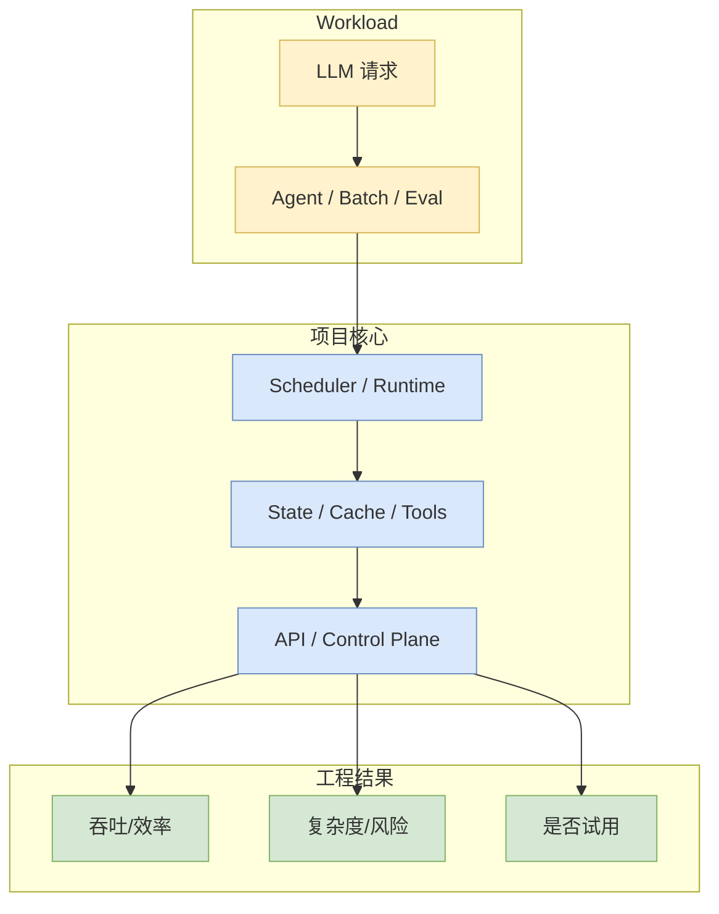

# huggingface/transformers

> 日期：2026-08-07  
> 来源类型：GitHub Repo / direct watched fallback  
> 来源：huggingface/transformers  
> 原文：https://github.com/huggingface/transformers

## 一句话结论
🤗 Transformers: the model-definition framework for state-of-the-art machine learning models in text, vision, audio, and multimodal models, for both inference and training. 

## TL;DR
- 这条信号与 AI Infra / LLM / Agent / RL 工作流相关，优先看工程可落地性而不是热度。
- 当前采集可能包含 API rate limit fallback；需要二次验证发布日期和完整 release notes。
- 对用户价值：用于评估 serving/training/agent loop 工具链是否值得试用。

## 元信息表
| 字段 | 内容 |
|---|---|
| 标题 | huggingface/transformers |
| 来源 | huggingface/transformers |
| 来源类型 | GitHub Repo / direct watched fallback |
| 日期 | 2026-08-07 |
| 原文 | https://github.com/huggingface/transformers |
| 可信度 | 中；自动采集 + 直接链接验证，部分来源可能低置信 |

## 信息压缩图示

## 影响矩阵
| 维度 | 判断 | 跟进动作 |
|---|---|---|
| AI Infra | 关注调度、Serving、训练或工具链接口变化 | 加入观察清单 |
| LLM / Agent | 关注上下文、工具调用、评测和权限模式 | 读原文与 changelog |
| RL / Game AI | 若涉及环境、bot、评测，可转化为仿真/benchmark 灵感 | 仅保留强相关部分 |
| 风险 | 自动采集无法替代人工阅读全文 | 重要条目二次验证 |

## 专业解读
用于评估 serving/training/agent loop 工具链是否值得试用。 如果这是工具/项目更新，重点不是“又发版了”，而是它是否改变 coding-agent loop：权限、上下文、远程执行、MCP、IDE 集成、评测闭环和可观测性。

## 通俗解释
可以把这条看成一个外部信号：它提示今天的 AI 工程生态在哪些地方继续投入，是否值得我们把注意力迁移到新的工具、论文或 repo 上。

## 关键机制拆解
| 机制 | 观察点 | 价值 |
|---|---|---|
| 输入 | 原文/release/repo 元数据 | 判断是否真实更新 |
| 处理 | 与 AI Infra/RL/Agent 关键词匹配 | 过滤泛 AI 噪音 |
| 输出 | 日报导航 + 详情页 | 便于 Obsidian 复盘 |

## 对我的影响
用于评估 serving/training/agent loop 工具链是否值得试用。

## 可信度与局限性
- GitHub Search 今日出现 403 rate limit，部分榜单使用 direct watched repo fallback。
- 公司博客和工具 changelog 未必都有当天新项；矩阵保留“无高相关新项/低置信”是为了证明已扫描。

## 我应该如何跟进
1. 打开原文确认是否与当前工作流直接相关。
2. 如果是 repo/release，查看 examples、docs、benchmark 和 issues。
3. 如果是论文，优先读方法图、实验设置和局限性。

## 相关链接
- 原文：https://github.com/huggingface/transformers
- Daily：[[Daily/2026-08-07]]

## 标签
#ai-radar #detail #ai-infra #llm #agent
