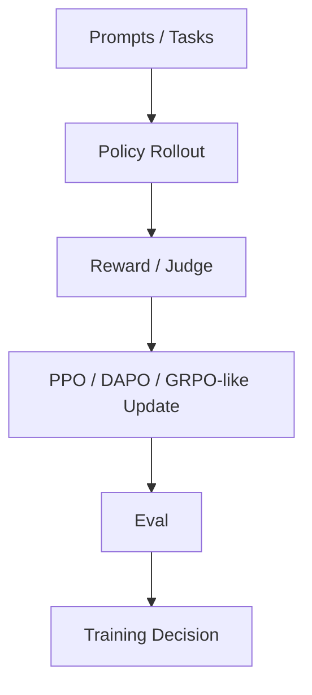

# OpenRLHF/OpenRLHF

> 日期：2026-08-08  
> 来源：GitHub direct watched repo fallback  
> 原文：https://github.com/OpenRLHF/OpenRLHF

## 一句话结论
OpenRLHF 是 RLHF / agentic RL 训练框架观察项，可连接 post-training 与评测闭环。

## 跟进建议
检查 Ray scaling、算法支持和是否能接入 coding/game task reward。

#ai-radar #github #rlhf
