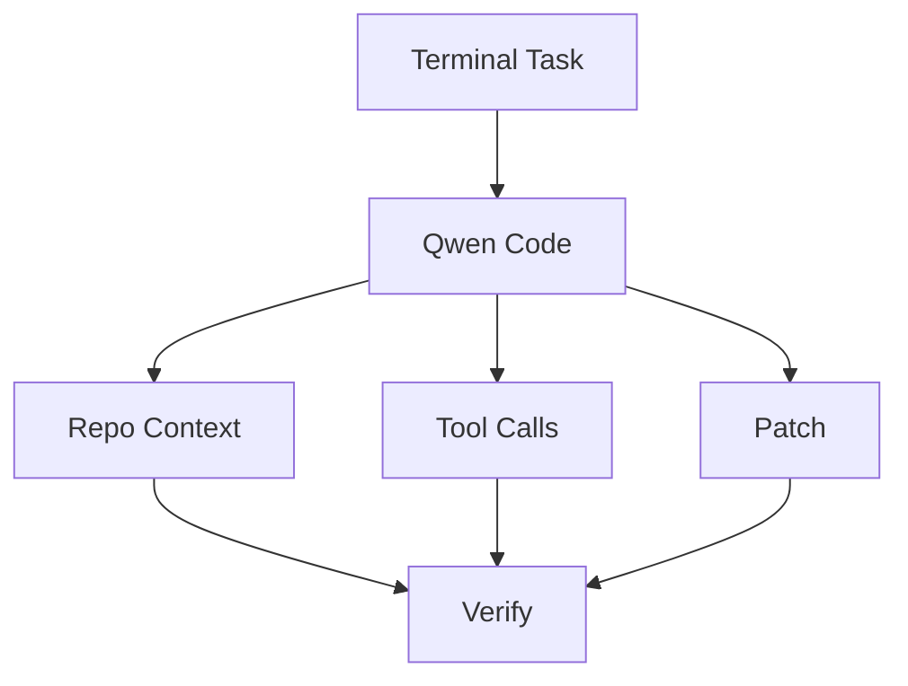

# QwenLM/qwen-code

> 日期：2026-08-08  
> 来源：GitHub direct watched repo fallback  
> 原文：https://github.com/QwenLM/qwen-code

## 一句话结论
Qwen Code 是开源 coding-agent CLI 的重要观察项，今日 release 源显示 v0.21.7。

## 跟进建议
与 Codex / Claude Code 对比 CLI 体验、权限、MCP、上下文窗口和验证机制。

#ai-radar #github #coding-agent
