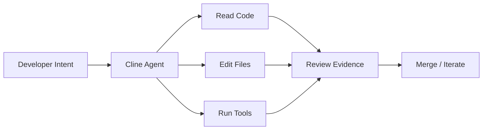

# cline/cline

> 日期：2026-08-08  
> 来源：GitHub direct watched repo fallback  
> 原文：https://github.com/cline/cline

## 一句话结论
Cline 是 IDE/CLI coding-agent 工作流的重要观察项，今日同时出现在高 star 和增长榜。

## TL;DR
- 主题：autonomous coding agent / IDE extension / CLI assistant。
- 价值：影响 review loop、tool permission、上下文管理和代码执行体验。
- 局限：需人工确认 desktop-v0.0.10 的具体功能变化。

## 信息压缩图示

## 影响矩阵
| 维度 | 判断 | 跟进 |
|---|---|---|
| Coding workflow | 高 | 观察权限和上下文变化 |
| 工具链 | 中 | 与 Claude Code / Codex / Roo 对比 |
| 风险 | 中 | 关注自动执行边界 |

#ai-radar #github #coding-agent
