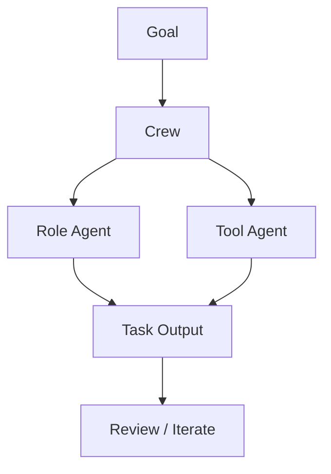

# crewAIInc/crewAI

> 日期：2026-08-08  
> 来源：GitHub direct watched repo fallback  
> 原文：https://github.com/crewAIInc/crewAI

## 一句话结论
CrewAI 是 role-playing multi-agent 编排框架，今日在 watched repo 增长中保持高信号。

## 跟进建议
对比 AutoGen / LangGraph 的 state、role、tool use 和 eval loop 抽象。

#ai-radar #github #agent
