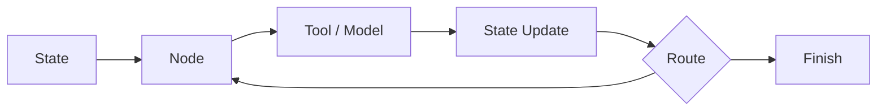

# langchain-ai/langgraph

> 日期：2026-08-08  
> 来源：GitHub direct watched repo fallback  
> 原文：https://github.com/langchain-ai/langgraph

## 一句话结论
LangGraph 是 resilient agent workflow 的关键框架，今日在增长榜中保持高信号。

## 跟进建议
研究 graph/state abstraction、恢复机制、human-in-the-loop 和 eval node 如何接入 coding agent。

#ai-radar #github #agent
