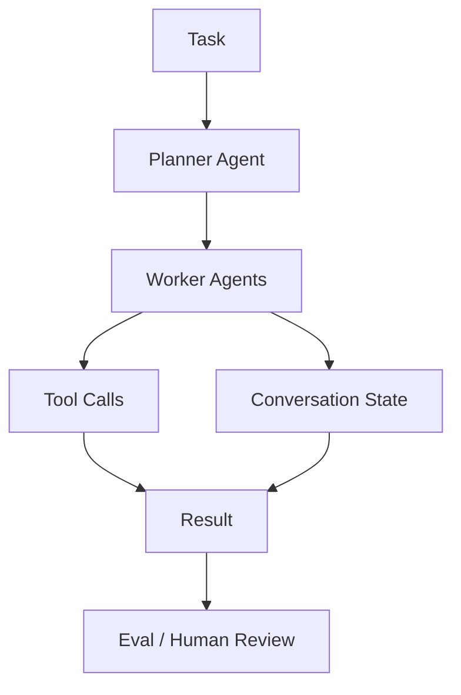

# microsoft/autogen

> 日期：2026-08-08  
> 来源：GitHub direct watched repo fallback  
> 原文：https://github.com/microsoft/autogen

## 一句话结论
AutoGen 仍是多 agent 编排与 agentic framework 的高 star 参考项目。

## TL;DR
- 主题：multi-agent orchestration / tool use / agent framework。
- 价值：可作为 Loop Engineer、评测闭环和多角色协作设计参考。
- 局限：需要按实际业务评估复杂度和依赖。

## 信息压缩图示

## 影响矩阵
| 维度 | 判断 | 跟进 |
|---|---|---|
| Agent orchestration | 高 | 对比 LangGraph / CrewAI |
| Eval loop | 中 | 检查是否适合自动评测 |
| 生产复杂度 | 中 | 需要限制 agent 权限和状态膨胀 |

#ai-radar #github #agent
