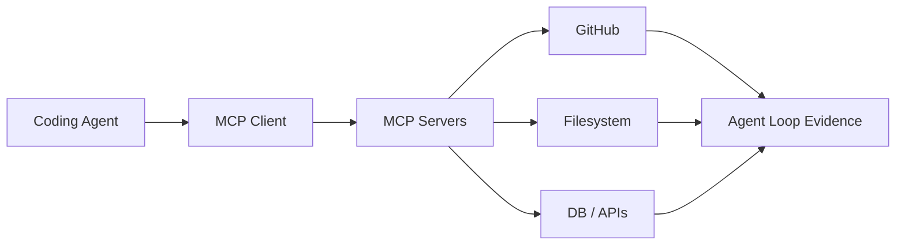

# modelcontextprotocol/servers

> 日期：2026-08-08  
> 来源：GitHub direct watched repo fallback  
> 原文：https://github.com/modelcontextprotocol/servers

## 一句话结论
MCP servers 是 agent tool-use 生态的核心接口集合，直接影响 coding-agent 与内部系统集成方式。

## TL;DR
- 主题：MCP / tool calling / agent integration。
- 价值：决定 agent 能否稳定访问文件、GitHub、DB、浏览器和内部服务。
- 局限：今日增长为 watched repo fallback，非完整全网日增。

## 信息压缩图示

## 影响矩阵
| 维度 | 判断 | 跟进 |
|---|---|---|
| Agent workflow | 高 | 检查可用 server 与权限边界 |
| 安全 | 高 | 关注 tool permission 和 sandbox |
| 落地 | 高 | 可直接试用常用 server |

#ai-radar #github #mcp
