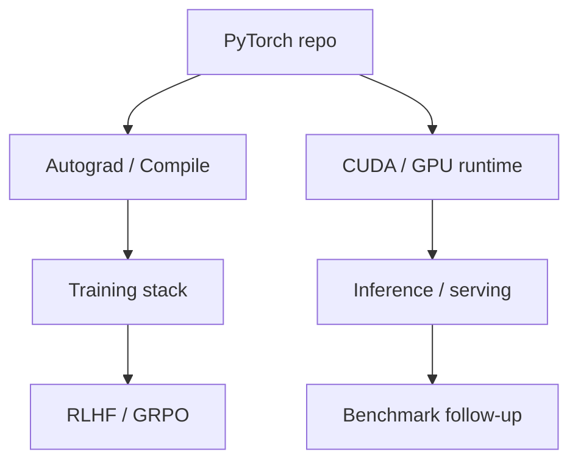

# pytorch/pytorch

> 日期：2026-08-08  
> 来源：GitHub direct watched repo fallback  
> 原文：https://github.com/pytorch/pytorch

## 一句话结论
PyTorch 仍是训练与推理底座核心观察项，今日以 watched repo fallback 进入高 star Top 10。

## TL;DR
- 主题：distributed training / compiler / GPU runtime。
- 价值：任何 serving、post-training、RL 训练栈最终都会受 PyTorch runtime 与编译路径影响。
- 局限：今日只确认 repo 元数据，未人工审读 release diff。

## 信息压缩图示

## 影响矩阵
| 维度 | 判断 | 跟进 |
|---|---|---|
| 训练 | 高 | 跟踪 compile、distributed、kernel 更新 |
| 推理 | 中 | 关注 torch compile 与 serving 框架联动 |
| 风险 | 中 | 需要读 release / issue 确认真实变化 |

## 我应该如何跟进
打开 release、benchmark 和最近 PR，确认是否影响当前训练/推理栈。

#ai-radar #github #ai-infra
