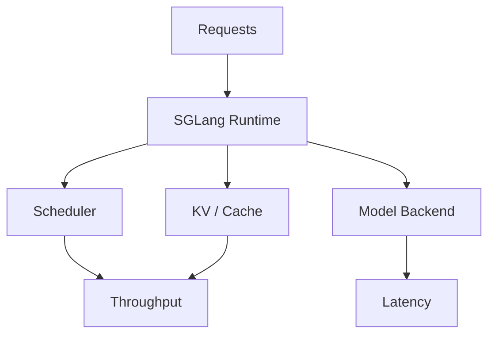

# sgl-project/sglang

> 日期：2026-08-08  
> 来源：GitHub direct watched repo fallback  
> 原文：https://github.com/sgl-project/sglang

## 一句话结论
SGLang 是高性能 LLM serving 框架，适合与 vLLM / TensorRT-LLM 对比 scheduler、batching 和多模态 serving。

## 跟进建议
对比 vLLM 最近 release，重点看 structured generation、multi-modal、cache 和 benchmark。

#ai-radar #github #serving
