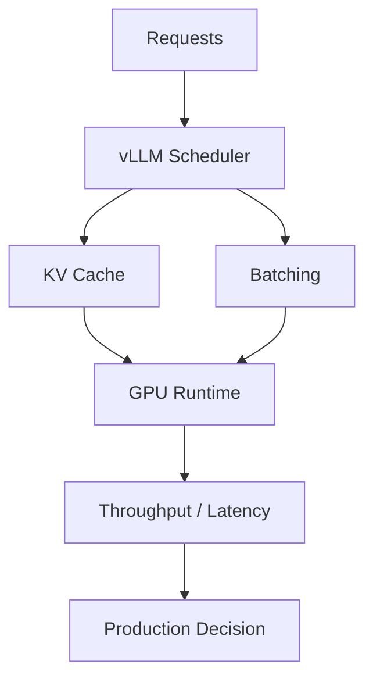

# vllm-project/vllm

> 日期：2026-08-08  
> 来源：GitHub direct watched repo fallback  
> 原文：https://github.com/vllm-project/vllm

## 一句话结论
vLLM 继续是 LLM serving 高吞吐路径的关键观察项，今日增长榜仍显示强信号。

## TL;DR
- 主题：LLM serving / scheduler / KV cache / batching。
- 价值：直接影响在线推理吞吐、延迟和成本。
- 局限：需人工确认近期 release 是否改变 scheduler、kernel 或模型支持。

## 信息压缩图示

## 影响矩阵
| 维度 | 判断 | 跟进 |
|---|---|---|
| Serving | 高 | 对比 SGLang / TensorRT-LLM |
| 成本 | 高 | 关注吞吐和显存效率 |
| 风险 | 中 | benchmark 需在自有模型上复测 |

#ai-radar #github #serving
