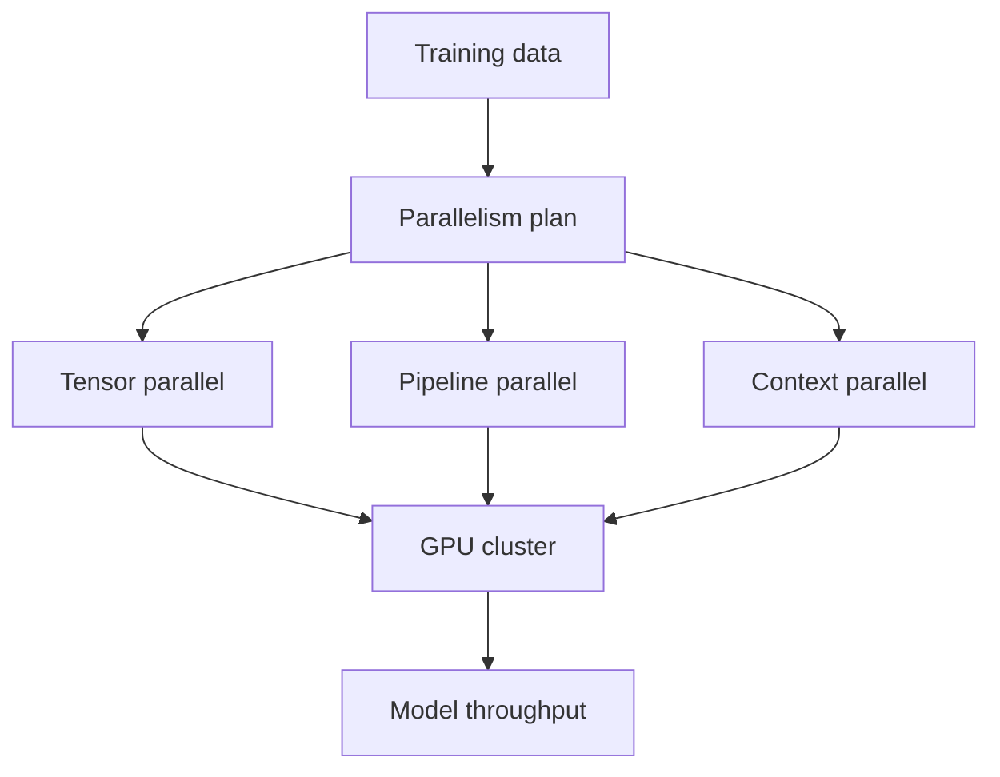

# NVIDIA/Megatron-LM

> Type: GitHub detail
> Date: 2026-08-09
> Source: https://github.com/NVIDIA/Megatron-LM
> Back: [[Daily/2026-08-09]]

## One-line takeaway

Megatron-LM remains a core watched repo for large-scale distributed training patterns.

## Mermaid overview

## Impact

Useful for training infra engineers tracking scale-out strategy and system bottlenecks.

#ai-radar #training #nvidia
