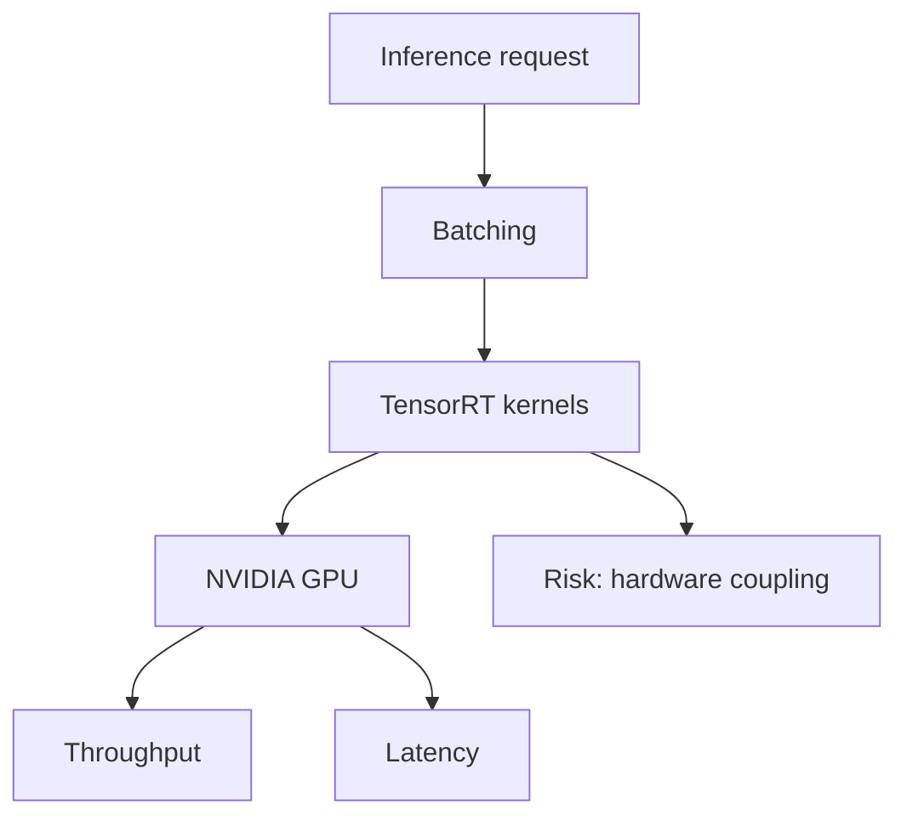

# NVIDIA/TensorRT-LLM

> Type: GitHub detail
> Date: 2026-08-09
> Source: https://github.com/NVIDIA/TensorRT-LLM
> Back: [[Daily/2026-08-09]]

## One-line takeaway

TensorRT-LLM is the NVIDIA GPU inference runtime watch item for kernel, quantization, and serving performance.

## Mermaid overview

## Impact

Track it for production LLM serving decisions, especially when comparing vLLM, SGLang, and vendor-optimized runtimes.

#ai-radar #serving #nvidia
