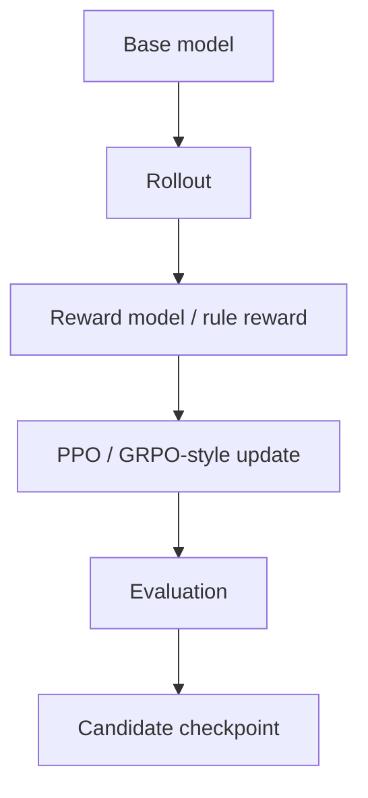

# OpenRLHF/OpenRLHF

> Type: GitHub detail
> Date: 2026-08-09
> Source: https://github.com/OpenRLHF/OpenRLHF
> Back: [[Daily/2026-08-09]]

## One-line takeaway

OpenRLHF remains a practical watched framework for scalable RLHF and agentic RL experiments.

## Mermaid overview

## Impact

For post-training and game model work, this is a useful reference for distributed rollout and training orchestration.

#ai-radar #rlhf #github
