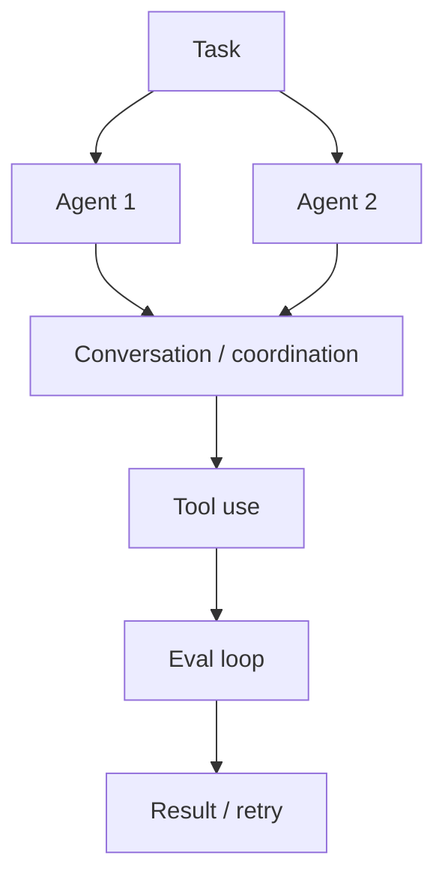

# microsoft/autogen

> Type: GitHub detail
> Date: 2026-08-09
> Source: https://github.com/microsoft/autogen
> Back: [[Daily/2026-08-09]]

## One-line takeaway

AutoGen remains a high-signal multi-agent orchestration repo for loop engineering and agent evaluation.

## Mermaid overview

## Impact

Useful as a reference for multi-agent coding workflows, task decomposition, and conversation-based evaluation loops.

#ai-radar #agent #loop-engineering
