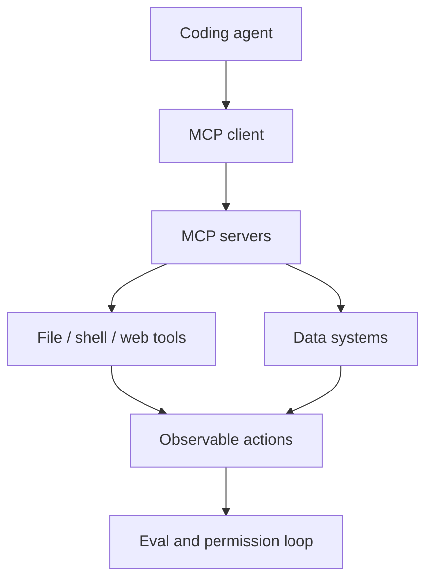

# modelcontextprotocol/servers

> Type: GitHub detail
> Date: 2026-08-09
> Source: https://github.com/modelcontextprotocol/servers
> Back: [[Daily/2026-08-09]]

## One-line takeaway

MCP servers remain a key infrastructure layer for agent tool-use standardization.

## Mermaid overview

## Why it matters

For loop engineering, MCP is the boundary between agents and tools. Watch server coverage, permission models, and observability patterns.

#ai-radar #mcp #agent
