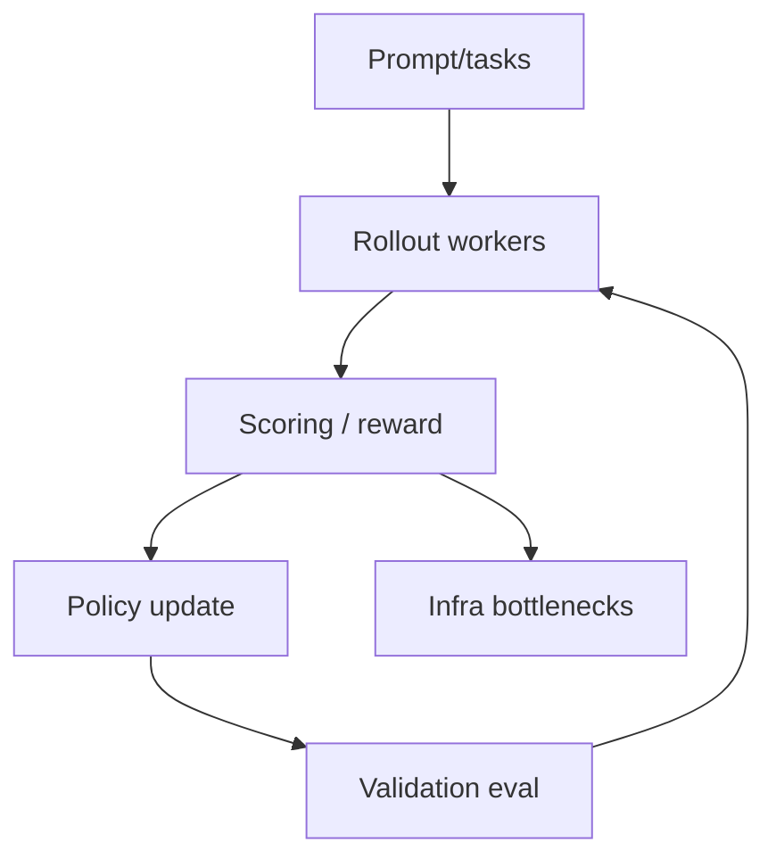

# verl-project/verl

> Type: GitHub detail
> Date: 2026-08-09
> Source: https://github.com/verl-project/verl
> Back: [[Daily/2026-08-09]]

## One-line takeaway

verl is a key RL post-training framework watch item for PPO, GRPO, rollout, and reward/eval pipelines.

## Mermaid overview

## Impact

Relevant to RLHF and game-agent training because it exposes the rollout, reward, and update loop as infrastructure.

#ai-radar #rlhf #post-training
