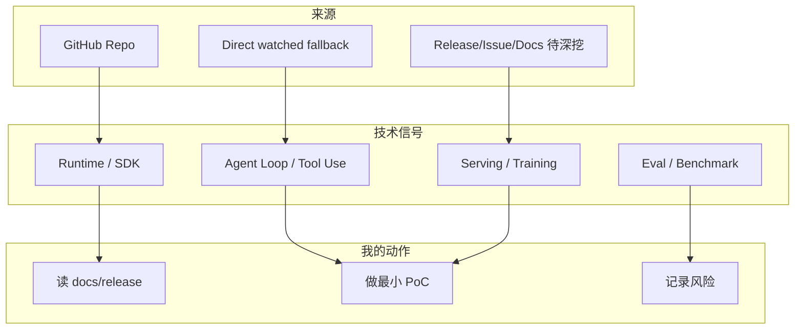

# deepspeedai/DeepSpeed - AI Radar 详情 (2026-08-10)

## 一句话结论
分布式训练与推理优化框架；关注 ZeRO、并行与大模型训练成本。

## TL;DR
- 来源：GitHub direct `/repos` watched fallback。
- Stars / Forks：42888 / 4925；语言：Python；更新：2026-08-09T22:00:27Z。
- 今日判断：可 skim；growth 仅代表 watched repo 非完整全网日增。

## 元信息表
| 字段 | 内容 |
|---|---|
| Repo | `deepspeedai/DeepSpeed` |
| 来源类型 | GitHub Repository / direct watched repo fallback |
| Stars | 42888 |
| Forks | 4925 |
| Language | Python |
| Topics | billion-parameters, compression, data-parallelism, deep-learning, gpu, inference, machine-learning, mixture-of-experts, model-parallelism, pipeline-parallelism, pytorch, trillion-parameters |
| updated_at | 2026-08-09T22:00:27Z |
| stars_delta | 0 |
| 增长依据 | direct watched repo fallback vs github-stars-2026-08-09.json; 非完整全网日增 |
| 原文链接 | https://github.com/deepspeedai/DeepSpeed |

## 信息压缩图示

## 影响矩阵
| 维度 | 判断 | 跟进动作 |
|---|---|---|
| AI Infra | 高 | 观察 benchmark、docs、examples |
| Coding Agent Loop | 中 | 关注权限、MCP、上下文和 eval loop |
| 生产可用性 | 中 | 先做小规模 PoC |
| 风险 | fallback 非完整全网 | 不把 delta 当全网增长 |

## 专业解读
分布式训练与推理优化框架；关注 ZeRO、并行与大模型训练成本。 今天的价值在于维持对关键基础设施 / agent workflow 的连续监控，而不是宣称其必然发布了重大新功能。

## 可信度与局限性
元数据来自 GitHub direct API；排名与增长均为 watched set fallback。

## 相关链接
- 原文：https://github.com/deepspeedai/DeepSpeed
- Daily：[[Daily/2026-08-10]]

#ai-radar #github #ai-infra #loop-engineering
