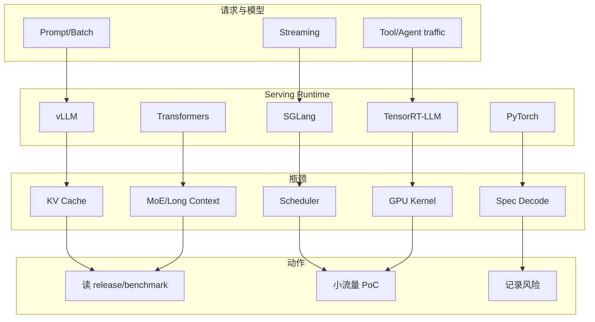

# Serving Watchlist - 2026-08-10

## 一句话结论
vLLM / SGLang / TensorRT-LLM / Transformers / PyTorch 构成今日 AI Infra serving/training 的高置信 watched set；GitHub Search 403 后仍可用 direct repo metadata 保持连续观察。

## 主图

## 今日判断
| 项目 | 作用 | 跟进动作 |
|---|---|---|
| vLLM | 高吞吐 serving | 看 scheduler/KV cache/release |
| SGLang | structured generation 与 serving runtime | 看 runtime / VLM / RL serving |
| TensorRT-LLM | NVIDIA GPU inference | 看硬件适配与 benchmark |
| Transformers | 模型生态入口 | 看新模型与量化接入 |
| PyTorch | 训练/推理底层 | 看 compile/distributed/GPU runtime |

#ai-radar #serving #ai-infra
