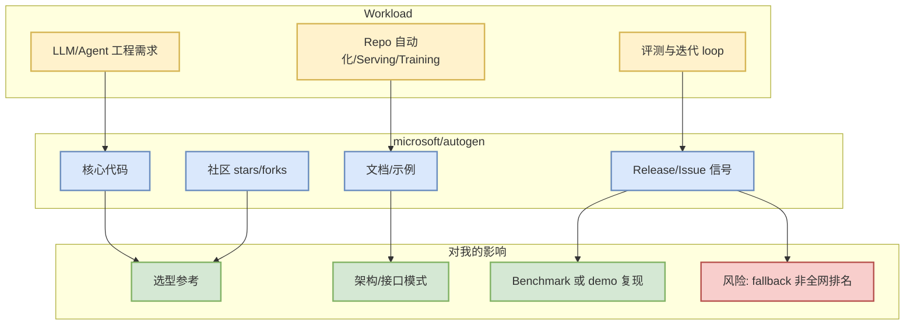

# microsoft/autogen - 2026-08-11

> 一句话结论：`microsoft/autogen` 是今日 AI Infra watched fallback 里的高信号项目；由于 GitHub Search 403，本页把它作为可验证 direct `/repos` 信号，而非完整全网排名。

## TL;DR
- Repo：[microsoft/autogen](https://github.com/microsoft/autogen)
- Stars / Forks：60353 / 9095
- 语言：Python
- 更新时间：2026-08-11T00:57:49Z
- 今日增长：22（direct watched repo fallback vs github-stars-2026-08-10.json; 非完整全网日增）
- 主题：agentic, agentic-agi, agents, ai, autogen, autogen-ecosystem, chatgpt, framework, llm-agent, llm-framework

## 元信息表
| 字段 | 值 |
|---|---|
| 来源 | GitHub direct `/repos` |
| 来源类型 | Repository metadata / watched fallback |
| 原文链接 | https://github.com/microsoft/autogen |
| 描述 | A programming framework for agentic AI |
| 是否值得试用 | 值得 skim；若与当前 serving/training/coding-agent 栈重合则开小样本试用 |

## 信息压缩图示

## 影响矩阵
| 维度 | 判断 | 对 AI Infra / LLM / RL 工程意义 |
|---|---|---|
| 可落地性 | 中高 | 可直接 clone/read docs，适合小样本验证 |
| 工程价值 | 中高 | 与 serving、agent loop、training 或 eval workflow 相关 |
| 风险 | 中 | 今日 GitHub Search rate limit，排名为 watched fallback |
| 下一步 | skim/专项 diff | 对 release、benchmark、examples 做最小复现 |

## 专业解读
这个条目的价值不在“今日全网唯一新项目”，而在它位于用户长期关注的 AI Infra / coding-agent / post-training 工程面。direct `/repos` 数据可验证 stars、forks、updated_at，用于在 Search 被限流时维持连续观察。

## 通俗解释
把它当成今天仍然值得盯的工具/框架：如果它和你的推理、训练、agent 自动化或评测工作流有关，就优先看最新 release、README 和 examples。

## 关键机制拆解
- 元数据：stars/forks/updated_at 判断热度和维护活跃度。
- 工程接口：README、examples、release notes 判断是否能接入现有栈。
- 风险控制：今日榜单明确标注 fallback，不把它伪装成完整 GitHub Trending。

## 对我的影响
- AI Infra：帮助判断 serving/training/runtime 生态方向。
- Loop Engineer：帮助设计 CLI/TUI agent、MCP、权限边界和 eval loop。
- RL/Game AI：若涉及 post-training 或 environment harness，可抽象为 rollout/evaluator 组件。

## 可信度与局限性
可信度：中高（GitHub direct API 可验证）。局限：不是完整全网搜索排名，增长只相对昨日 snapshot 中存在的 watched repo。

## 我应该如何跟进
1. 打开原文链接 skim README/release。
2. 若有 benchmark/examples，建立最小复现。
3. 对比昨日 snapshot 的 stars_delta，不把 fallback 增长当作全网真实增长。

## 相关链接
- 原文：https://github.com/microsoft/autogen
- 日报：[[Daily/2026-08-11]]

#ai-radar #github #ai-infra #loop-engineering
