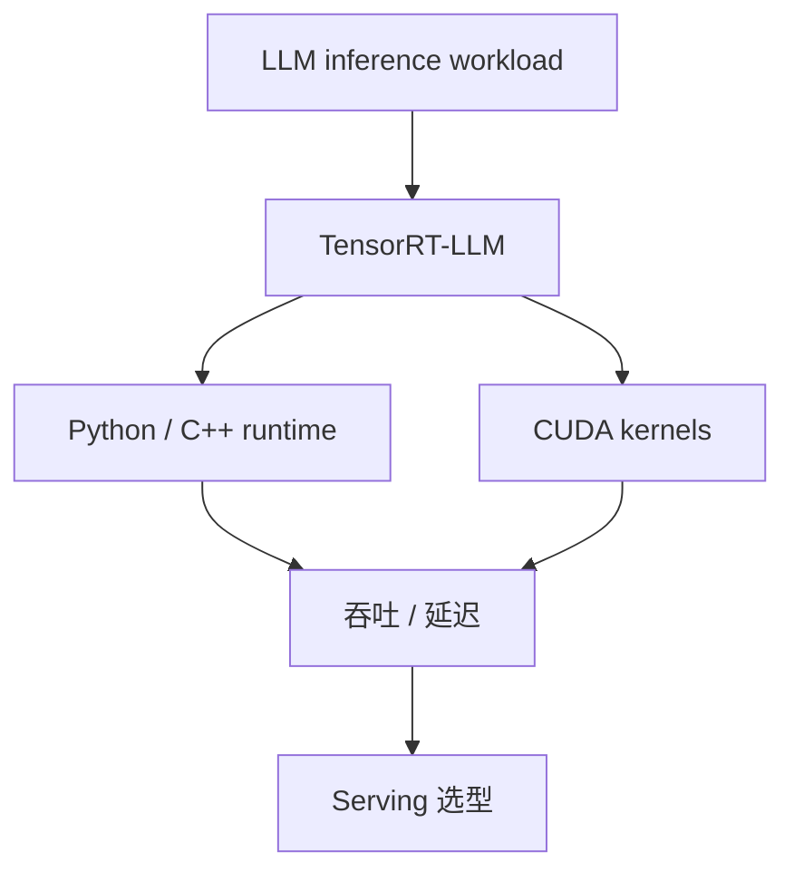

# NVIDIA/TensorRT-LLM

> 日期：2026-08-12
> 来源类型：GitHub Repository / direct watched fallback

## 一句话结论
TensorRT-LLM 仍是 NVIDIA GPU LLM inference runtime 的关键观测点，适合继续跟踪 Blackwell、MoE、CUDA runtime 与 serving 优化。

## TL;DR
- 原文：https://github.com/NVIDIA/TensorRT-LLM
- stars / forks：14360 / 2654
- language：Python
- updated_at：2026-08-12T00:59:41Z
- topics：blackwell, cuda, llm-serving, moe, pytorch

## 影响矩阵
| 维度 | 判断 |
|---|---|
| AI Infra / Serving | 高 |
| 可信度 | direct /repos 可验证，但非完整全网榜单 |

## 对我的影响
后续重点关注 KV cache、batching、MoE、Blackwell 支持、runtime API 与 vLLM/SGLang 的差异。

## 相关链接
- 今日日报：[[Daily/2026-08-12]]
- 原文：https://github.com/NVIDIA/TensorRT-LLM

#ai-radar #ai-infra #serving
