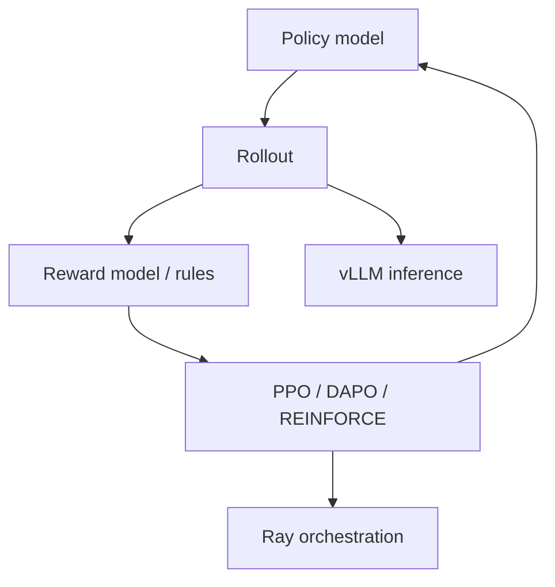

# OpenRLHF/OpenRLHF

> 日期：2026-08-12
> 来源类型：GitHub Repository / direct watched fallback

## 一句话结论
OpenRLHF 是 Ray/vLLM 方向的 RLHF/Agentic RL 工程观察点，可与 verl 对比 rollout、reward、异步 RL 与训练资源调度。

## TL;DR
- 原文：https://github.com/OpenRLHF/OpenRLHF
- stars / forks：9901 / 998
- language：Python
- updated_at：2026-08-11T11:16:29Z
- topics：large-language-models, PPO, RLHF, vLLM, Ray

## 影响矩阵
| 维度 | 判断 |
|---|---|
| RL / Post-training | 高 |
| 可信度 | direct /repos 可验证，但非完整全网榜单 |

## 对我的影响
适合跟踪 agentic RL、VLM/RLHF、异步 rollout 与 serving-training 协同。

## 相关链接
- 今日日报：[[Daily/2026-08-12]]
- 原文：https://github.com/OpenRLHF/OpenRLHF

#ai-radar #rlhf #ai-infra
