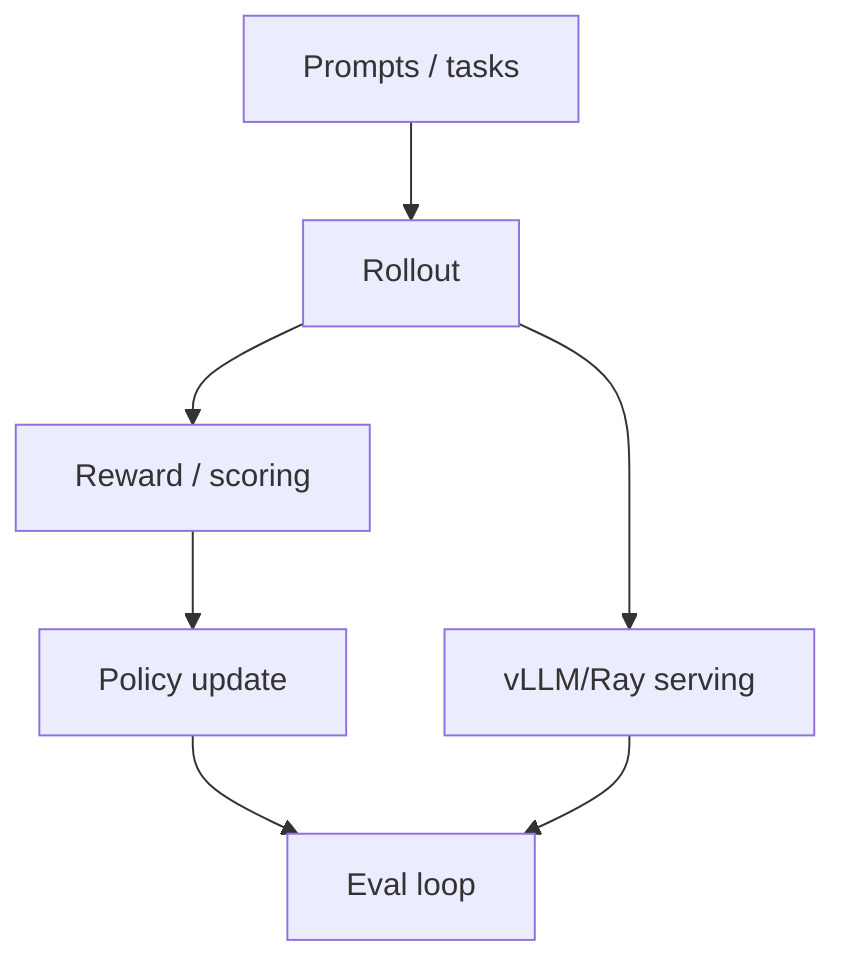

# verl-project/verl

> 日期：2026-08-12
> 来源类型：GitHub Repository / direct watched fallback

## 一句话结论
verl 是 RL post-training 工程栈的固定观测点，适合跟踪 HybridFlow、rollout、reward、vLLM/Ray 集成。

## TL;DR
- 原文：https://github.com/verl-project/verl
- stars / forks：22918 / 4382
- language：Python
- updated_at：2026-08-11T20:45:10Z
- 摘要：A Flexible and Efficient RL Post-Training Framework

## 影响矩阵
| 维度 | 判断 |
|---|---|
| RLHF / Post-training | 高 |
| 可信度 | direct /repos 可验证，但非完整全网榜单 |

## 对我的影响
适合用于研究 RLHF/GRPO/PPO rollout 架构、资源调度、reward design 与 eval harness。

## 相关链接
- 今日日报：[[Daily/2026-08-12]]
- 原文：https://github.com/verl-project/verl

#ai-radar #rlhf #post-training
