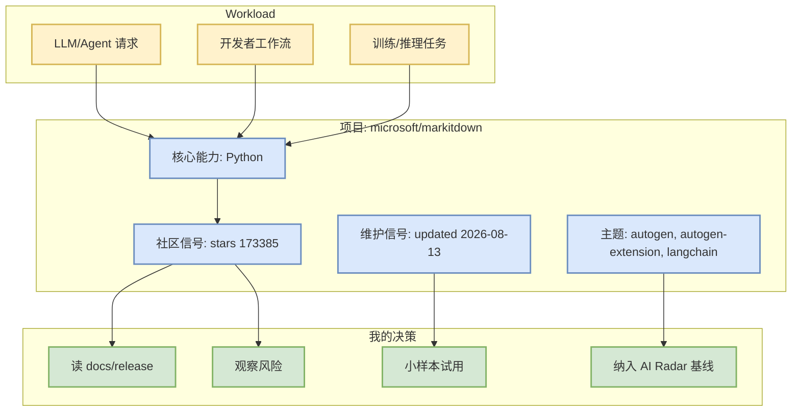

# microsoft/markitdown

> 类型：GitHub 项目
> 大类：GitHub
> 小类：AIInfra
> 推荐等级：必读
> 创建日期：2026-08-13
> 原文链接：https://github.com/microsoft/markitdown
> 网页详情：https://github.com/dyt27666-oss/AI-news-report-obsidians/blob/main/GitHub/AIInfra/2026-08-13/microsoft-markitdown.md
> 返回日报：[[Daily/2026-08-13]]

## 一句话结论

microsoft/markitdown 是今日榜单中的高信号项目；在本次 GitHub Search 403 限流下，元数据来自 direct `/repos` fallback，需要把 star 增长解读为 watched-repo 范围内的连续性信号。

## TL;DR

- **它是什么**：Python tool for converting files and office documents to Markdown.
- **为什么重要**：它处在 AI Infra / Agent / coding workflow 的核心依赖链上，stars=173385，forks=12662。
- **和我相关的点**：可用于判断 serving、训练、agent loop 或 coding-agent 工具链的工程成熟度。
- **建议动作**：关注 release / benchmark / docs；增长明显的项目优先试用或纳入 watchlist。

## 元信息

| 字段 | 内容 |
|---|---|
| repo | microsoft/markitdown |
| stars / forks | 173385 / 12662 |
| language | Python |
| updated_at | 2026-08-13T01:05:25Z |
| pushed_at | 2026-07-29T18:18:09Z |
| topics | autogen, autogen-extension, langchain, markdown, microsoft-office, openai, pdf |
| stars_delta | None |
| 增长依据 | direct watched repo fallback, baseline missing |
| 原文 | [GitHub](https://github.com/microsoft/markitdown) |

## 信息压缩图示

### 辅助结构：试用判断

| 维度 | 判断 | 说明 |
|---|---|---|
| 社区成熟度 | 高 | stars/forks 说明生态吸引力，但不等价于生产可用。 |
| 维护活跃 | 高 | direct metadata 显示近期 updated。 |
| 对 AI Infra | 中 | 需结合 benchmark/docs 判断。 |
| 对 coding loop | 中/低 | 适合纳入多 agent workflow 观察。 |

## 专业解读

本条来自 direct watched-repo fallback，而不是 GitHub Search 的全网排序。它的价值主要在于连续追踪核心 AI Infra / coding-agent repo 的 stars、更新时间与 release 活跃度。对于 serving/training 项目，重点看 scheduler、KV cache、kernel、并行与硬件适配；对于 coding-agent 项目，重点看权限模式、MCP/插件、远程执行、IDE/CLI 集成与 session 恢复。

## 通俗解释

把它当成“今天仍然值得看的一线项目”。如果增长高，说明社区今天仍在涌入；如果更新时间很近，说明维护节奏活跃。

## 关键机制拆解

| 机制 | 解决的问题 | 为什么有效 | 可能的坑 |
|---|---|---|---|
| direct `/repos` 元数据 | Search API 限流时维持日报 | 不依赖 Search 配额 | 不是全网 Top，属于 watched set |
| stars_delta | 观察趋势变化 | 与昨日 snapshot 对比 | 仅对有 baseline 的 repo 可靠 |
| topics/description 过滤 | 保持 AI 相关性 | 降低无关项目混入 | topics 可能缺失 |

## 对我的影响

| 维度 | 影响 | 建议动作 |
|---|---|---|
| AI Infra | 作为工具链/框架成熟度信号 | 看 docs、examples、benchmark |
| LLM 工程 | 判断是否影响 serving、训练或 agent runtime | 跟踪 release notes |
| RL / Game AI | 若涉及 RL/post-training，可映射到训练框架 | 只保留强相关 |
| Agent / Eval | 若涉及 coding agent/MCP，可纳入 loop 工程 | 小样本试用 |

## 可信度与局限性

- 证据强度：中；GitHub direct API 元数据可靠，但今天 Search 403，榜单不是全网完整搜索。
- 局限性：stars_delta 只在 watched repo / snapshot baseline 范围内解释。
- 还需要确认：最新 release 具体功能变化、benchmark 与兼容性。

## 我应该如何跟进

1. 打开 repo 的 release / docs / examples。
2. 对增长榜前 3 做本地或隔离环境试用。
3. 若涉及 serving/training，记录 benchmark 和部署约束。

## 相关链接

- 原文：https://github.com/microsoft/markitdown
- 网页详情：https://github.com/dyt27666-oss/AI-news-report-obsidians/blob/main/GitHub/AIInfra/2026-08-13/microsoft-markitdown.md
- 返回日报：[[Daily/2026-08-13]]

## 标签

#ai-radar #github #aiinfra
