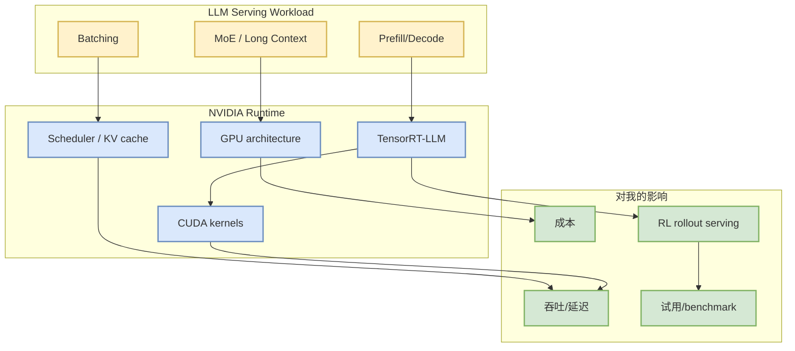

# NVIDIA TensorRT-LLM

> 一句话结论：TensorRT-LLM 是 NVIDIA LLM serving/optimization 栈的核心 watched repo；今日 Daily 中作为公司矩阵与 AI Infra direct fallback 信号。

## TL;DR

- Repo：[NVIDIA/TensorRT-LLM](https://github.com/NVIDIA/TensorRT-LLM)
- 来源类型：GitHub direct watched repo / NVIDIA engineering signal
- 关注点：Blackwell、MoE、KV cache、batching、GPU kernel、LLM serving runtime
- 可信度：GitHub Search 今日 403，本页为 direct fallback alias/detail，非完整全网排名。

## 专业解读

TensorRT-LLM 对 AI Infra 的价值在于把模型 serving 性能优化绑定到 NVIDIA GPU 软件栈。对线上推理和 RL rollout runtime，最值得跟踪的是 kernel、KV cache、scheduler、MoE/long context 支持以及 benchmark。

## 可信度与局限性

- 今日 GitHub Search rate-limited；本页只作为 direct watched repo fallback detail。
- 需要后续读取 release notes / docs / benchmark 后才能做具体版本判断。

## 相关链接

- 原文：https://github.com/NVIDIA/TensorRT-LLM
- Daily：[[Daily/2026-08-14]]

#ai-radar #github #ai-infra #serving
